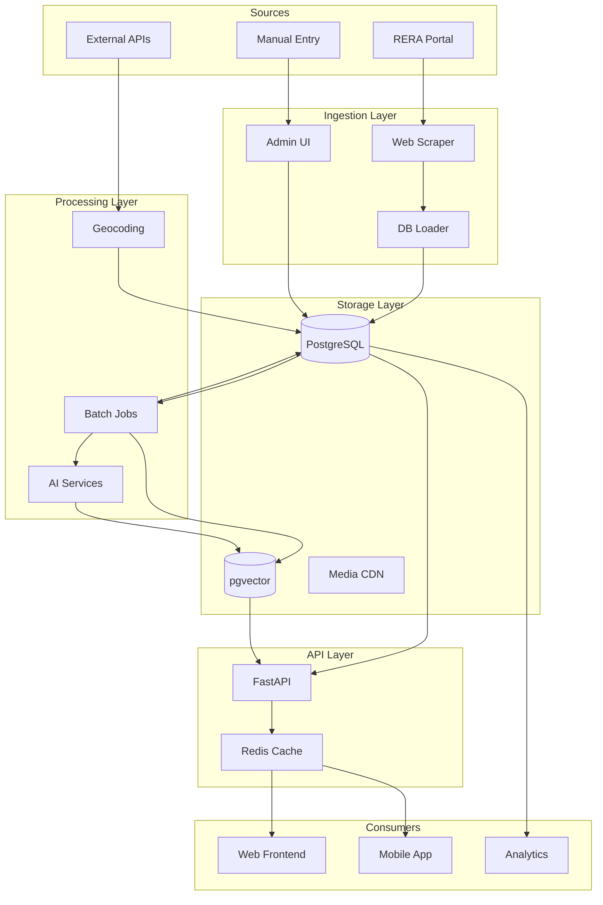
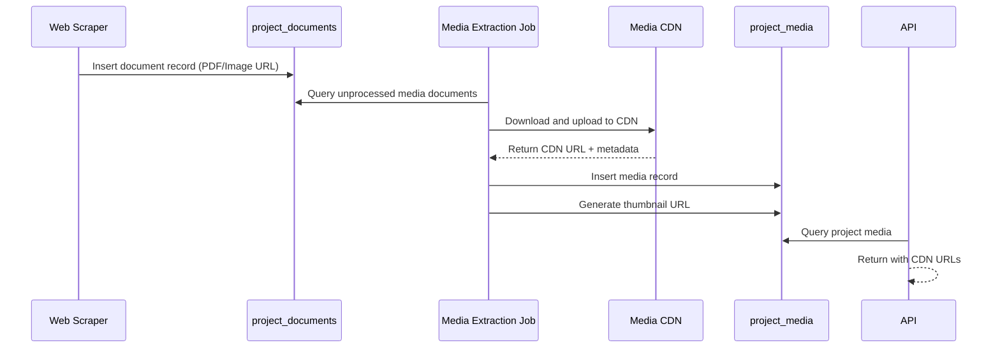
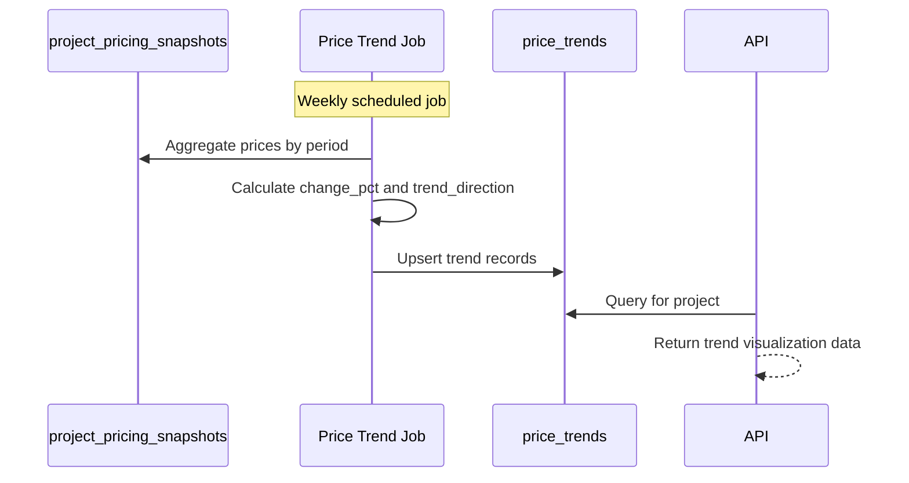
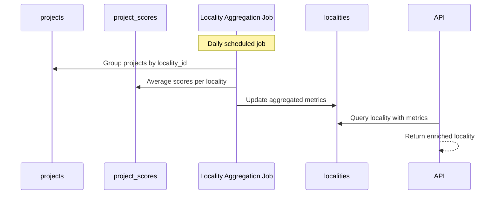

# Technical Specification Document
## RealMap Schema Evolution to 99acres-Level Data Richness

**Document Version:** 1.0  
**Date:** January 2, 2026  
**Author:** Principal Software Architect & Data Platform Lead  
**Database:** PostgreSQL 14+  
**ORM:** SQLAlchemy 2.0+

---

## Table of Contents

1. [Data Model Changes](#1-data-model-changes)
2. [Data Flow Architecture](#2-data-flow-architecture)
3. [API/Service Layer Implications](#3-apiservice-layer-implications)
4. [Migration Plan](#4-migration-plan)
5. [Risks & Mitigations](#5-risks--mitigations)
6. [Appendices](#appendices)

---

## 1. Data Model Changes

### 1.1 Modified Tables

#### 1.1.1 `projects` Table Enhancements

**Current State:** 203 lines, ~50 columns  
**Location:** `cg_rera_extractor/db/models.py:27-203`

| Column Name | Data Type | Nullable | Default | Index | Purpose |
|:---|:---|:---:|:---:|:---:|:---|
| `listing_type` | `VARCHAR(30)` | ✅ | `NULL` | BTREE | "new_launch", "under_construction", "ready_to_move" |
| `property_type` | `VARCHAR(50)` | ✅ | `NULL` | BTREE | "apartment", "villa", "plot", "commercial" |
| `view_count` | `INTEGER` | ✅ | `0` | - | Analytics tracking |
| `featured_at` | `TIMESTAMPTZ` | ✅ | `NULL` | BTREE | Featured listing promotion |
| `meta_description` | `TEXT` | ✅ | `NULL` | - | SEO description |
| `slug` | `VARCHAR(200)` | ✅ | `NULL` | UNIQUE | SEO-friendly URL |
| `stamp_duty_rate` | `NUMERIC(5,2)` | ✅ | `7.0` | - | State stamp duty % |
| `registration_rate` | `NUMERIC(5,2)` | ✅ | `1.0` | - | Registration % |
| `gst_applicable` | `BOOLEAN` | ✅ | `NULL` | - | GST flag |
| `gst_rate` | `NUMERIC(5,2)` | ✅ | `NULL` | - | GST percentage |
| `locality_id` | `INTEGER` | ✅ | `NULL` | BTREE | FK → `localities.id` |

**SQLAlchemy ORM Addition:**

```python
# Add to Project class in models.py

# Phase 0 Additions
listing_type: Mapped[str | None] = mapped_column(
    String(30), 
    doc="new_launch | under_construction | ready_to_move"
)
property_type: Mapped[str | None] = mapped_column(
    String(50),
    doc="apartment | villa | plot | commercial"
)
view_count: Mapped[int] = mapped_column(Integer, default=0)
featured_at: Mapped[datetime | None] = mapped_column(DateTime(timezone=True))
meta_description: Mapped[str | None] = mapped_column(Text)
slug: Mapped[str | None] = mapped_column(String(200), unique=True, index=True)
stamp_duty_rate: Mapped[Decimal | None] = mapped_column(Numeric(5, 2), default=7.0)
registration_rate: Mapped[Decimal | None] = mapped_column(Numeric(5, 2), default=1.0)
gst_applicable: Mapped[bool | None] = mapped_column(Boolean)
gst_rate: Mapped[Decimal | None] = mapped_column(Numeric(5, 2))

# Phase 2 Addition
locality_id: Mapped[int | None] = mapped_column(
    Integer, ForeignKey("localities.id"), index=True
)
locality: Mapped["Locality"] = relationship(back_populates="projects")
```

---

#### 1.1.2 `project_unit_types` Table Enhancements

**Current State:** Lines 518-565 in `models.py`

| Column Name | Data Type | Nullable | Index | Purpose |
|:---|:---|:---:|:---:|:---|
| `base_price_inr` | `NUMERIC(14,2)` | ✅ | - | Starting price for configuration |
| `price_per_sqft_carpet` | `NUMERIC(10,2)` | ✅ | - | Price/sqft (carpet) |
| `price_per_sqft_super` | `NUMERIC(10,2)` | ✅ | - | Price/sqft (super built-up) |
| `floor_plan_image_url` | `VARCHAR(1024)` | ✅ | - | Direct image URL |
| `has_3d_view` | `BOOLEAN` | ✅ | - | 3D tour available |

**SQLAlchemy ORM Addition:**

```python
# Add to ProjectUnitType class

base_price_inr: Mapped[Decimal | None] = mapped_column(Numeric(14, 2))
price_per_sqft_carpet: Mapped[Decimal | None] = mapped_column(Numeric(10, 2))
price_per_sqft_super: Mapped[Decimal | None] = mapped_column(Numeric(10, 2))
floor_plan_image_url: Mapped[str | None] = mapped_column(String(1024))
has_3d_view: Mapped[bool | None] = mapped_column(Boolean, default=False)
```

---

#### 1.1.3 `project_pricing_snapshots` Enhancements

**Current State:** Lines 773-816 in `models.py` (Empty table)

| Column Name | Data Type | Nullable | Index | Purpose |
|:---|:---|:---:|:---:|:---|
| `unit_type_label` | `VARCHAR(50)` | ✅ | BTREE | Link to unit configuration |
| `price_source` | `VARCHAR(30)` | ✅ | BTREE | "rera", "manual", "scraped" |
| `currency_code` | `VARCHAR(3)` | ✅ | - | Default "INR" |

**SQLAlchemy ORM Addition:**

```python
# Add to ProjectPricingSnapshot class

unit_type_label: Mapped[str | None] = mapped_column(String(50), index=True)
price_source: Mapped[str | None] = mapped_column(
    String(30), 
    index=True,
    doc="rera | manual | scraped"
)
currency_code: Mapped[str | None] = mapped_column(String(3), default="INR")
```

---

### 1.2 New Tables

#### 1.2.1 `project_media`

**Purpose:** Structured media asset management for photos, videos, and virtual tours.

```sql
CREATE TABLE project_media (
    id SERIAL PRIMARY KEY,
    project_id INTEGER NOT NULL REFERENCES projects(id) ON DELETE CASCADE,
    media_type VARCHAR(30) NOT NULL CHECK (media_type IN ('photo', 'video', 'virtual_tour', 'drone', 'floor_plan')),
    category VARCHAR(50) CHECK (category IN ('exterior', 'interior', 'amenity', 'floor_plan', 'construction', 'other')),
    url VARCHAR(1024) NOT NULL,
    thumbnail_url VARCHAR(1024),
    title VARCHAR(255),
    alt_text VARCHAR(255),
    sort_order INTEGER DEFAULT 0,
    is_primary BOOLEAN DEFAULT FALSE,
    width INTEGER,
    height INTEGER,
    file_size_bytes INTEGER,
    duration_seconds INTEGER,  -- For videos
    source_document_id INTEGER REFERENCES project_documents(id),
    created_at TIMESTAMP WITH TIME ZONE NOT NULL DEFAULT NOW(),
    updated_at TIMESTAMP WITH TIME ZONE
);

-- Indexes
CREATE INDEX ix_project_media_project_id ON project_media(project_id);
CREATE INDEX ix_project_media_type ON project_media(media_type);
CREATE INDEX ix_project_media_category ON project_media(category);
CREATE UNIQUE INDEX ix_project_media_primary ON project_media(project_id) WHERE is_primary = TRUE;

-- Constraint: Only one primary image per project
CREATE UNIQUE INDEX uq_project_media_primary_per_project 
    ON project_media(project_id) WHERE is_primary = TRUE;
```

**SQLAlchemy ORM:**

```python
class ProjectMedia(Base):
    """Media asset for a project (photos, videos, virtual tours)."""
    
    __tablename__ = "project_media"
    __table_args__ = (
        Index("ix_project_media_project_id", "project_id"),
        Index("ix_project_media_type", "media_type"),
        Index("ix_project_media_category", "category"),
    )
    
    id: Mapped[int] = mapped_column(Integer, primary_key=True, autoincrement=True)
    project_id: Mapped[int] = mapped_column(Integer, ForeignKey("projects.id", ondelete="CASCADE"), nullable=False)
    media_type: Mapped[str] = mapped_column(String(30), nullable=False)  # photo|video|virtual_tour|drone|floor_plan
    category: Mapped[str | None] = mapped_column(String(50))  # exterior|interior|amenity|floor_plan|construction
    url: Mapped[str] = mapped_column(String(1024), nullable=False)
    thumbnail_url: Mapped[str | None] = mapped_column(String(1024))
    title: Mapped[str | None] = mapped_column(String(255))
    alt_text: Mapped[str | None] = mapped_column(String(255))
    sort_order: Mapped[int] = mapped_column(Integer, default=0)
    is_primary: Mapped[bool] = mapped_column(Boolean, default=False)
    width: Mapped[int | None] = mapped_column(Integer)
    height: Mapped[int | None] = mapped_column(Integer)
    file_size_bytes: Mapped[int | None] = mapped_column(Integer)
    duration_seconds: Mapped[int | None] = mapped_column(Integer)  # For videos
    source_document_id: Mapped[int | None] = mapped_column(Integer, ForeignKey("project_documents.id"))
    created_at: Mapped[datetime] = mapped_column(DateTime(timezone=True), server_default=func.now())
    updated_at: Mapped[datetime | None] = mapped_column(DateTime(timezone=True), onupdate=func.now())
    
    project: Mapped["Project"] = relationship(back_populates="media")
    source_document: Mapped["ProjectDocument"] = relationship()
```

---

#### 1.2.2 `localities`

**Purpose:** Locality-level intelligence for aggregated metrics and SEO.

```sql
CREATE TABLE localities (
    id SERIAL PRIMARY KEY,
    name VARCHAR(255) NOT NULL,
    slug VARCHAR(255) NOT NULL UNIQUE,
    city VARCHAR(100),
    district VARCHAR(100),
    state_code VARCHAR(10),
    polygon_geojson JSONB,
    centroid_lat NUMERIC(9, 6),
    centroid_lng NUMERIC(9, 6),
    description TEXT,
    
    -- Aggregated Metrics (computed)
    avg_price_per_sqft NUMERIC(10, 2),
    total_projects INTEGER DEFAULT 0,
    total_units INTEGER DEFAULT 0,
    avg_connectivity_score NUMERIC(4, 2),
    avg_lifestyle_score NUMERIC(4, 2),
    avg_safety_score NUMERIC(4, 2),
    avg_environment_score NUMERIC(4, 2),
    
    last_computed_at TIMESTAMP WITH TIME ZONE,
    created_at TIMESTAMP WITH TIME ZONE NOT NULL DEFAULT NOW(),
    updated_at TIMESTAMP WITH TIME ZONE
);

-- Indexes
CREATE UNIQUE INDEX ix_localities_slug ON localities(slug);
CREATE INDEX ix_localities_city ON localities(city);
CREATE INDEX ix_localities_district ON localities(district);
CREATE INDEX ix_localities_state_code ON localities(state_code);

-- Spatial index if PostGIS is available
-- CREATE INDEX ix_localities_centroid ON localities USING GIST(ST_MakePoint(centroid_lng, centroid_lat));
```

**SQLAlchemy ORM:**

```python
class Locality(Base):
    """Locality entity for geographic aggregation and SEO."""
    
    __tablename__ = "localities"
    __table_args__ = (
        UniqueConstraint("slug", name="uq_localities_slug"),
        Index("ix_localities_city", "city"),
        Index("ix_localities_district", "district"),
    )
    
    id: Mapped[int] = mapped_column(Integer, primary_key=True, autoincrement=True)
    name: Mapped[str] = mapped_column(String(255), nullable=False)
    slug: Mapped[str] = mapped_column(String(255), nullable=False, unique=True)
    city: Mapped[str | None] = mapped_column(String(100), index=True)
    district: Mapped[str | None] = mapped_column(String(100), index=True)
    state_code: Mapped[str | None] = mapped_column(String(10))
    polygon_geojson: Mapped[dict | None] = mapped_column(JSON)
    centroid_lat: Mapped[Decimal | None] = mapped_column(Numeric(9, 6))
    centroid_lng: Mapped[Decimal | None] = mapped_column(Numeric(9, 6))
    description: Mapped[str | None] = mapped_column(Text)
    
    # Aggregated metrics
    avg_price_per_sqft: Mapped[Decimal | None] = mapped_column(Numeric(10, 2))
    total_projects: Mapped[int] = mapped_column(Integer, default=0)
    total_units: Mapped[int] = mapped_column(Integer, default=0)
    avg_connectivity_score: Mapped[Decimal | None] = mapped_column(Numeric(4, 2))
    avg_lifestyle_score: Mapped[Decimal | None] = mapped_column(Numeric(4, 2))
    avg_safety_score: Mapped[Decimal | None] = mapped_column(Numeric(4, 2))
    avg_environment_score: Mapped[Decimal | None] = mapped_column(Numeric(4, 2))
    
    last_computed_at: Mapped[datetime | None] = mapped_column(DateTime(timezone=True))
    created_at: Mapped[datetime] = mapped_column(DateTime(timezone=True), server_default=func.now())
    updated_at: Mapped[datetime | None] = mapped_column(DateTime(timezone=True), onupdate=func.now())
    
    projects: Mapped[list["Project"]] = relationship(back_populates="locality")
    reviews: Mapped[list["LocalityReview"]] = relationship(back_populates="locality", cascade="all, delete-orphan")
```

---

#### 1.2.3 `price_trends`

**Purpose:** Time-series price analytics for investment insights.

```sql
CREATE TABLE price_trends (
    id SERIAL PRIMARY KEY,
    project_id INTEGER NOT NULL REFERENCES projects(id) ON DELETE CASCADE,
    period_type VARCHAR(20) NOT NULL CHECK (period_type IN ('monthly', 'quarterly', 'yearly')),
    period_start DATE NOT NULL,
    period_end DATE NOT NULL,
    
    avg_price_per_sqft NUMERIC(10, 2),
    min_price_per_sqft NUMERIC(10, 2),
    max_price_per_sqft NUMERIC(10, 2),
    avg_total_price NUMERIC(14, 2),
    
    change_pct NUMERIC(6, 2),  -- Period-over-period change
    trend_direction VARCHAR(10) CHECK (trend_direction IN ('up', 'down', 'stable')),
    sample_count INTEGER,  -- Number of data points in period
    
    computed_at TIMESTAMP WITH TIME ZONE NOT NULL DEFAULT NOW(),
    
    UNIQUE(project_id, period_type, period_start)
);

-- Indexes
CREATE INDEX ix_price_trends_project_id ON price_trends(project_id);
CREATE INDEX ix_price_trends_period ON price_trends(period_type, period_start);
```

**SQLAlchemy ORM:**

```python
class PriceTrend(Base):
    """Aggregated price trend data for analytics."""
    
    __tablename__ = "price_trends"
    __table_args__ = (
        UniqueConstraint("project_id", "period_type", "period_start", name="uq_price_trends_key"),
        Index("ix_price_trends_project_id", "project_id"),
        Index("ix_price_trends_period", "period_type", "period_start"),
    )
    
    id: Mapped[int] = mapped_column(Integer, primary_key=True, autoincrement=True)
    project_id: Mapped[int] = mapped_column(Integer, ForeignKey("projects.id", ondelete="CASCADE"), nullable=False)
    period_type: Mapped[str] = mapped_column(String(20), nullable=False)  # monthly|quarterly|yearly
    period_start: Mapped[date] = mapped_column(Date, nullable=False)
    period_end: Mapped[date] = mapped_column(Date, nullable=False)
    
    avg_price_per_sqft: Mapped[Decimal | None] = mapped_column(Numeric(10, 2))
    min_price_per_sqft: Mapped[Decimal | None] = mapped_column(Numeric(10, 2))
    max_price_per_sqft: Mapped[Decimal | None] = mapped_column(Numeric(10, 2))
    avg_total_price: Mapped[Decimal | None] = mapped_column(Numeric(14, 2))
    
    change_pct: Mapped[Decimal | None] = mapped_column(Numeric(6, 2))
    trend_direction: Mapped[str | None] = mapped_column(String(10))  # up|down|stable
    sample_count: Mapped[int | None] = mapped_column(Integer)
    
    computed_at: Mapped[datetime] = mapped_column(DateTime(timezone=True), server_default=func.now())
    
    project: Mapped["Project"] = relationship()
```

---

#### 1.2.4 `locality_reviews`

**Purpose:** User-generated locality ratings and reviews.

```sql
CREATE TABLE locality_reviews (
    id SERIAL PRIMARY KEY,
    locality_id INTEGER NOT NULL REFERENCES localities(id) ON DELETE CASCADE,
    user_id INTEGER,  -- FK to users table when implemented
    
    overall_rating NUMERIC(2, 1) NOT NULL CHECK (overall_rating >= 1.0 AND overall_rating <= 5.0),
    connectivity_rating NUMERIC(2, 1) CHECK (connectivity_rating >= 1.0 AND connectivity_rating <= 5.0),
    safety_rating NUMERIC(2, 1) CHECK (safety_rating >= 1.0 AND safety_rating <= 5.0),
    lifestyle_rating NUMERIC(2, 1) CHECK (lifestyle_rating >= 1.0 AND lifestyle_rating <= 5.0),
    
    review_text TEXT,
    pros TEXT[],  -- Array of positive points
    cons TEXT[],  -- Array of negative points
    
    status VARCHAR(20) NOT NULL DEFAULT 'pending' CHECK (status IN ('pending', 'approved', 'rejected', 'flagged')),
    moderated_by INTEGER,  -- FK to admin users
    moderated_at TIMESTAMP WITH TIME ZONE,
    moderation_note TEXT,
    
    helpful_count INTEGER DEFAULT 0,
    report_count INTEGER DEFAULT 0,
    
    created_at TIMESTAMP WITH TIME ZONE NOT NULL DEFAULT NOW(),
    updated_at TIMESTAMP WITH TIME ZONE
);

-- Indexes
CREATE INDEX ix_locality_reviews_locality_id ON locality_reviews(locality_id);
CREATE INDEX ix_locality_reviews_status ON locality_reviews(status);
CREATE INDEX ix_locality_reviews_rating ON locality_reviews(overall_rating);
```

---

#### 1.2.5 `search_facets`

**Purpose:** Precomputed faceted search counts for filter UI.

```sql
CREATE TABLE search_facets (
    id SERIAL PRIMARY KEY,
    facet_type VARCHAR(50) NOT NULL,  -- bhk, price_range, locality, amenity, status
    facet_value VARCHAR(100) NOT NULL,
    display_label VARCHAR(100) NOT NULL,
    parent_value VARCHAR(100),  -- For hierarchical facets
    
    project_count INTEGER NOT NULL DEFAULT 0,
    unit_count INTEGER DEFAULT 0,
    
    is_active BOOLEAN DEFAULT TRUE,
    sort_order INTEGER DEFAULT 0,
    
    last_computed_at TIMESTAMP WITH TIME ZONE NOT NULL DEFAULT NOW(),
    
    UNIQUE(facet_type, facet_value)
);

-- Indexes
CREATE INDEX ix_search_facets_type ON search_facets(facet_type);
CREATE INDEX ix_search_facets_active ON search_facets(is_active) WHERE is_active = TRUE;
```

**Facet Types:**

| Facet Type | Values | Example |
|:---|:---|:---|
| `bhk` | "1bhk", "2bhk", "3bhk", "4bhk", "5bhk+" | `{ "2bhk": 45, "3bhk": 82 }` |
| `price_range` | "under_30l", "30l_50l", "50l_1cr", "1cr_2cr", "above_2cr" | Price buckets |
| `locality` | Locality IDs | Per-locality counts |
| `status` | "approved", "under_construction", "completed" | Project status |
| `amenity` | Amenity codes | "pool", "gym", "cctv" |
| `property_type` | "apartment", "villa", "plot" | Property type |

---

#### 1.2.6 `project_ai_features`

**Purpose:** Vectorized features for recommendation and similarity.

```sql
CREATE TABLE project_ai_features (
    id SERIAL PRIMARY KEY,
    project_id INTEGER NOT NULL REFERENCES projects(id) ON DELETE CASCADE UNIQUE,
    
    -- Embeddings (requires pgvector extension)
    text_embedding vector(384),  -- Description/summary embedding
    image_embedding vector(512),  -- Primary image embedding
    feature_vector vector(128),  -- Compressed multi-modal embedding
    
    -- Structured features for ML
    structured_features JSONB NOT NULL DEFAULT '{}'::jsonb,
    
    -- Feature metadata
    text_source TEXT,  -- Source text used for embedding
    image_source VARCHAR(1024),  -- Source image URL
    model_version VARCHAR(50),  -- Embedding model identifier
    
    computed_at TIMESTAMP WITH TIME ZONE NOT NULL DEFAULT NOW(),
    is_stale BOOLEAN DEFAULT FALSE
);

-- Indexes
CREATE UNIQUE INDEX ix_project_ai_features_project_id ON project_ai_features(project_id);

-- Vector similarity indexes (HNSW for fast ANN)
CREATE INDEX ix_project_ai_text_embedding ON project_ai_features 
    USING hnsw (text_embedding vector_cosine_ops) 
    WITH (m = 16, ef_construction = 64);

CREATE INDEX ix_project_ai_feature_vector ON project_ai_features 
    USING hnsw (feature_vector vector_cosine_ops) 
    WITH (m = 16, ef_construction = 64);
```

**Structured Features Schema:**

```json
{
  "price_normalized": 0.65,           // 0-1 normalized price
  "area_normalized": 0.45,            // 0-1 normalized area
  "bhk_onehot": [0, 1, 0, 0, 0],      // 1-5 BHK one-hot
  "property_type_encoded": 0,         // apartment=0, villa=1, plot=2
  "amenity_vector": [1, 1, 0, 1, 0],  // Binary amenity presence
  "locality_id": 42,                  // For filtering
  "developer_trust_score": 0.85,      // From developer entity
  "delay_risk_score": 0.12,           // From historical analysis
  "data_completeness": 0.78,          // QA metric
  "lifestyle_score": 7.2,             // From project_scores
  "connectivity_score": 8.1           // From project_scores
}
```

---

#### 1.2.7 `project_daily_stats` (Partitioned)

**Purpose:** Daily analytics mart for project performance tracking.

```sql
-- Parent table (partitioned by month)
CREATE TABLE project_daily_stats (
    id SERIAL,
    project_id INTEGER NOT NULL,
    stat_date DATE NOT NULL,
    
    view_count INTEGER DEFAULT 0,
    unique_viewers INTEGER DEFAULT 0,
    shortlist_count INTEGER DEFAULT 0,
    share_count INTEGER DEFAULT 0,
    contact_count INTEGER DEFAULT 0,
    
    search_impressions INTEGER DEFAULT 0,
    search_clicks INTEGER DEFAULT 0,
    ctr NUMERIC(5, 4),  -- Click-through rate
    
    avg_time_on_page_seconds INTEGER,
    bounce_rate NUMERIC(5, 4),
    
    created_at TIMESTAMP WITH TIME ZONE NOT NULL DEFAULT NOW(),
    
    PRIMARY KEY (id, stat_date)
) PARTITION BY RANGE (stat_date);

-- Create partitions for 2026
CREATE TABLE project_daily_stats_2026_01 PARTITION OF project_daily_stats
    FOR VALUES FROM ('2026-01-01') TO ('2026-02-01');
CREATE TABLE project_daily_stats_2026_02 PARTITION OF project_daily_stats
    FOR VALUES FROM ('2026-02-01') TO ('2026-03-01');
-- ... continue for all months

-- Indexes on partitions
CREATE INDEX ix_project_daily_stats_project_id ON project_daily_stats(project_id, stat_date);
CREATE INDEX ix_project_daily_stats_date ON project_daily_stats(stat_date);
```

---

### 1.3 Entity Relationship Diagram

```mermaid
erDiagram
    PROJECT ||--o{ PROJECT_MEDIA : has
    PROJECT ||--o{ PROJECT_UNIT_TYPE : contains
    PROJECT ||--o{ PROJECT_PRICING_SNAPSHOT : tracks
    PROJECT ||--o{ PRICE_TREND : generates
    PROJECT ||--o{ PROJECT_AI_FEATURES : embeds
    PROJECT ||--o{ PROJECT_DAILY_STATS : measures
    PROJECT }o--|| LOCALITY : "located in"
    
    LOCALITY ||--o{ LOCALITY_REVIEW : receives
    LOCALITY ||--o{ PROJECT : contains
    
    PROJECT ||--o{ PROJECT_AMENITY : offers
    AMENITY ||--o{ AMENITY_TYPE : variants
    AMENITY_CATEGORY ||--o{ AMENITY : contains
    
    PROJECT ||--o{ PROJECT_LANDMARK : "near"
    LANDMARK ||--o{ PROJECT_LANDMARK : "proximity"
    
    DEVELOPER ||--o{ DEVELOPER_PROJECT : develops
    PROJECT ||--o{ DEVELOPER_PROJECT : "developed by"
    
    PROJECT {
        int id PK
        string rera_registration_number UK
        string project_name
        string listing_type
        string property_type
        int locality_id FK
        decimal stamp_duty_rate
        string slug UK
        int view_count
    }
    
    PROJECT_MEDIA {
        int id PK
        int project_id FK
        string media_type
        string category
        string url
        bool is_primary
    }
    
    LOCALITY {
        int id PK
        string name
        string slug UK
        decimal avg_price_per_sqft
        int total_projects
    }
    
    PRICE_TREND {
        int id PK
        int project_id FK
        string period_type
        date period_start
        decimal change_pct
        string trend_direction
    }
    
    PROJECT_AI_FEATURES {
        int id PK
        int project_id FK UK
        vector text_embedding
        vector feature_vector
        jsonb structured_features
    }
```

---

## 2. Data Flow Architecture

### 2.1 High-Level Data Flow



### 2.2 Entity-Specific Data Flows

#### 2.2.1 Media Pipeline



#### 2.2.2 Price Trend Computation



#### 2.2.3 Locality Aggregation



### 2.3 Service Dependencies

| Service | Reads From | Writes To |
|:---|:---|:---|
| **Web Scraper** | RERA Portal | `projects`, `project_documents`, `data_provenance` |
| **DB Loader** | Scraper output | All transactional tables |
| **Media Job** | `project_documents`, `project_artifacts` | `project_media` |
| **Price Job** | `project_pricing_snapshots` | `price_trends` |
| **Locality Job** | `projects`, `project_scores` | `localities` |
| **Embedding Job** | `projects`, `document_extractions` | `project_ai_features` |
| **Facet Job** | `projects`, `project_amenities` | `search_facets` |
| **Analytics Job** | Event logs | `project_daily_stats` |
| **API** | All tables | `projects.view_count` |

---

## 3. API/Service Layer Implications

### 3.1 New API Endpoints

#### 3.1.1 Media Endpoints

| Method | Endpoint | Description |
|:---|:---|:---|
| `GET` | `/api/v1/projects/{id}/media` | List all media for project |
| `GET` | `/api/v1/projects/{id}/media/primary` | Get primary image |
| `POST` | `/api/v1/projects/{id}/media` | Upload new media (admin) |
| `DELETE` | `/api/v1/projects/{id}/media/{media_id}` | Delete media (admin) |

**Response Schema (GET media):**

```json
{
  "project_id": 1,
  "total_count": 15,
  "media": [
    {
      "id": 101,
      "type": "photo",
      "category": "exterior",
      "url": "https://cdn.realmap.in/media/proj1/ext1.jpg",
      "thumbnail_url": "https://cdn.realmap.in/media/proj1/ext1_thumb.jpg",
      "title": "Building Front View",
      "is_primary": true,
      "width": 1920,
      "height": 1080
    }
  ],
  "counts_by_type": {
    "photo": 12,
    "video": 2,
    "virtual_tour": 1
  }
}
```

#### 3.1.2 Locality Endpoints

| Method | Endpoint | Description |
|:---|:---|:---|
| `GET` | `/api/v1/localities` | List all localities with metrics |
| `GET` | `/api/v1/localities/{id}` | Get locality details |
| `GET` | `/api/v1/localities/{id}/projects` | Projects in locality |
| `GET` | `/api/v1/localities/{id}/price-trends` | Locality price trends |
| `GET` | `/api/v1/localities/{id}/reviews` | Locality reviews |
| `POST` | `/api/v1/localities/{id}/reviews` | Submit review (authenticated) |

#### 3.1.3 Price Intelligence Endpoints

| Method | Endpoint | Description |
|:---|:---|:---|
| `GET` | `/api/v1/projects/{id}/price-trends` | Project price history |
| `GET` | `/api/v1/projects/{id}/price-analysis` | Price comparison with locality |
| `GET` | `/api/v1/market/trends` | Market-wide price trends |

#### 3.1.4 Search Facets Endpoints

| Method | Endpoint | Description |
|:---|:---|:---|
| `GET` | `/api/v1/search/facets` | All available facets with counts |
| `GET` | `/api/v1/search/facets/{type}` | Specific facet type |
| `POST` | `/api/v1/search/filtered` | Search with facet filters |

### 3.2 Enhanced Existing Endpoints

#### 3.2.1 Project Detail Enhancement

**Endpoint:** `GET /api/v1/projects/{id}`

**New Response Fields (v1.1):**

```json
{
  "id": 1,
  "rera_registration_number": "PCGRERA...",
  "project_name": "Lotus Meadows",
  
  // EXISTING fields (unchanged)...
  
  // NEW Phase 0 fields
  "listing_type": "under_construction",
  "property_type": "apartment",
  "slug": "lotus-meadows-raipur",
  "stamp_duty_rate": 7.0,
  "registration_rate": 1.0,
  "gst_rate": 5.0,
  
  // NEW Phase 1 nested objects
  "media_summary": {
    "primary_image_url": "https://...",
    "photo_count": 12,
    "video_count": 2,
    "has_virtual_tour": true
  },
  "pricing_summary": {
    "min_price": 4500000,
    "max_price": 7200000,
    "price_per_sqft_carpet": 4200,
    "price_trend": "up",
    "price_change_pct_90d": 2.5,
    "last_updated": "2026-01-01"
  },
  "amenities": [
    {"code": "pool", "name": "Swimming Pool", "category": "recreation"},
    {"code": "gym", "name": "Gymnasium", "category": "health"}
  ],
  "nearby_landmarks": [
    {"name": "Phoenix Mall", "type": "mall", "distance_km": 2.5, "travel_time_min": 8},
    {"name": "Raipur Railway Station", "type": "railway", "distance_km": 5.2, "travel_time_min": 15}
  ],
  
  // NEW Phase 2 fields
  "locality": {
    "id": 42,
    "name": "Shankar Nagar",
    "slug": "shankar-nagar-raipur",
    "avg_price_per_sqft": 4500,
    "total_projects": 12
  },
  "developer": {
    "id": 7,
    "name": "ABC Developers",
    "total_projects": 5,
    "completed_on_time_pct": 80,
    "trust_score": 8.2
  }
}
```

### 3.3 Backward Compatibility Strategy

1. **Additive Only:** All new fields are optional in request/response
2. **Default Values:** Missing fields return `null` or sensible defaults
3. **No Field Removal:** Deprecated fields remain functional with warnings
4. **Version Header:** `X-API-Version: 1.1` for new features

### 3.4 API Versioning Approach

| Version | Availability | Changes |
|:---|:---|:---|
| v1 | Current | Existing endpoints, unchanged |
| v1.1 | Phase 1+ | New nested objects in responses |
| v1.2 | Phase 2+ | Locality, price trend, developer endpoints |
| v2 | Future | Breaking changes (after deprecation) |

**Deprecation Policy:**
- Announce deprecation 6 months before removal
- Log usage of deprecated fields
- Provide migration guides

---

## 4. Migration Plan

### 4.1 Migration File Structure

```
alembic_migrations/versions/
├── v002_phase0_project_columns.py
├── v003_phase0_unit_type_columns.py
├── v004_phase1_project_media.py
├── v005_phase1_pricing_enhancements.py
├── v006_phase2_localities.py
├── v007_phase2_price_trends.py
├── v008_phase2_locality_reviews.py
├── v009_phase3_search_facets.py
├── v010_phase3_ai_features.py
├── v011_phase3_daily_stats.py
```

### 4.2 Phase 0 Migration Scripts

#### v002_phase0_project_columns.py

```python
"""Add Phase 0 columns to projects table.

Revision ID: v002
Revises: <previous_revision>
Create Date: 2026-01-02
"""

from alembic import op
import sqlalchemy as sa

# revision identifiers
revision = 'v002_phase0_project'
down_revision = '<previous>'
branch_labels = None
depends_on = None


def upgrade() -> None:
    # Add new columns to projects table
    op.add_column('projects', sa.Column('listing_type', sa.String(30), nullable=True))
    op.add_column('projects', sa.Column('property_type', sa.String(50), nullable=True))
    op.add_column('projects', sa.Column('view_count', sa.Integer(), nullable=True, server_default='0'))
    op.add_column('projects', sa.Column('featured_at', sa.DateTime(timezone=True), nullable=True))
    op.add_column('projects', sa.Column('meta_description', sa.Text(), nullable=True))
    op.add_column('projects', sa.Column('slug', sa.String(200), nullable=True))
    op.add_column('projects', sa.Column('stamp_duty_rate', sa.Numeric(5, 2), nullable=True, server_default='7.0'))
    op.add_column('projects', sa.Column('registration_rate', sa.Numeric(5, 2), nullable=True, server_default='1.0'))
    op.add_column('projects', sa.Column('gst_applicable', sa.Boolean(), nullable=True))
    op.add_column('projects', sa.Column('gst_rate', sa.Numeric(5, 2), nullable=True))
    
    # Create indexes
    op.create_index('ix_projects_listing_type', 'projects', ['listing_type'])
    op.create_index('ix_projects_property_type', 'projects', ['property_type'])
    op.create_index('ix_projects_slug', 'projects', ['slug'], unique=True, postgresql_where="slug IS NOT NULL")


def downgrade() -> None:
    # Remove indexes
    op.drop_index('ix_projects_slug', 'projects')
    op.drop_index('ix_projects_property_type', 'projects')
    op.drop_index('ix_projects_listing_type', 'projects')
    
    # Remove columns
    op.drop_column('projects', 'gst_rate')
    op.drop_column('projects', 'gst_applicable')
    op.drop_column('projects', 'registration_rate')
    op.drop_column('projects', 'stamp_duty_rate')
    op.drop_column('projects', 'slug')
    op.drop_column('projects', 'meta_description')
    op.drop_column('projects', 'featured_at')
    op.drop_column('projects', 'view_count')
    op.drop_column('projects', 'property_type')
    op.drop_column('projects', 'listing_type')
```

### 4.3 Data Backfill Strategy

#### 4.3.1 Slug Generation

```python
# scripts/backfill_slugs.py
from slugify import slugify
from sqlalchemy.orm import Session
from cg_rera_extractor.db.models import Project

def generate_unique_slug(session: Session, project: Project) -> str:
    """Generate unique SEO-friendly slug for project."""
    base_slug = slugify(f"{project.project_name}-{project.district}")
    slug = base_slug
    counter = 1
    
    while session.query(Project).filter(Project.slug == slug, Project.id != project.id).first():
        slug = f"{base_slug}-{counter}"
        counter += 1
    
    return slug

def backfill_slugs():
    """Backfill slugs for all projects without one."""
    session = get_session()
    projects = session.query(Project).filter(Project.slug.is_(None)).all()
    
    for project in projects:
        project.slug = generate_unique_slug(session, project)
    
    session.commit()
    print(f"Updated {len(projects)} project slugs.")
```

#### 4.3.2 Locality Assignment

```python
# scripts/assign_localities.py
def assign_localities():
    """Assign projects to localities based on village_or_locality field."""
    session = get_session()
    
    # Create localities from unique village_or_locality values
    unique_localities = session.query(
        Project.village_or_locality,
        Project.district,
        Project.state_code
    ).distinct().all()
    
    for loc in unique_localities:
        if not loc.village_or_locality:
            continue
        
        locality = Locality(
            name=loc.village_or_locality,
            slug=slugify(f"{loc.village_or_locality}-{loc.district}"),
            city=loc.district,
            district=loc.district,
            state_code=loc.state_code
        )
        session.add(locality)
    
    session.flush()
    
    # Assign locality_id to projects
    for project in session.query(Project).all():
        if project.village_or_locality:
            locality = session.query(Locality).filter(
                Locality.name == project.village_or_locality
            ).first()
            if locality:
                project.locality_id = locality.id
    
    session.commit()
```

#### 4.3.3 Media Extraction

```python
# scripts/extract_media.py
import re
from urllib.parse import urljoin

MEDIA_EXTENSIONS = {'.jpg', '.jpeg', '.png', '.gif', '.webp', '.mp4', '.webm', '.pdf'}

def extract_media_from_documents():
    """Extract media URLs from project_documents and create project_media records."""
    session = get_session()
    
    docs = session.query(ProjectDocument).filter(
        ProjectDocument.url.isnot(None),
        ProjectDocument.url.op('~*')(r'\.(jpg|jpeg|png|gif|webp|mp4|webm)$')
    ).all()
    
    for doc in docs:
        ext = Path(doc.url).suffix.lower()
        media_type = 'photo' if ext in {'.jpg', '.jpeg', '.png', '.gif', '.webp'} else 'video'
        
        media = ProjectMedia(
            project_id=doc.project_id,
            media_type=media_type,
            category=infer_category(doc.doc_type, doc.description),
            url=doc.url,
            title=doc.description,
            source_document_id=doc.id
        )
        session.add(media)
    
    session.commit()
    print(f"Extracted {len(docs)} media records from documents.")
```

### 4.4 Rollback Procedures

| Phase | Rollback Command | Data Loss Risk |
|:---|:---|:---:|
| Phase 0 | `alembic downgrade v001` | 🟢 None (columns only) |
| Phase 1 | `alembic downgrade v003` | 🟡 Media, Pricing data lost |
| Phase 2 | `alembic downgrade v005` | 🟠 Localities, Trends lost |
| Phase 3 | `alembic downgrade v008` | 🔴 AI features, Analytics lost |

**Pre-Rollback Checklist:**
- [ ] Full database backup taken
- [ ] Downstream services notified
- [ ] API version headers checked
- [ ] Frontend feature flags disabled

---

## 5. Risks & Mitigations

### 5.1 Technical Risks

| Risk | Probability | Impact | Mitigation |
|:---|:---:|:---:|:---|
| **Schema bloat** | Medium | Medium | Quarterly column usage audit; drop unused columns |
| **Index overhead** | Medium | Medium | Monitor index bloat; REINDEX periodically |
| **Query performance** | Low | High | Pre-migration EXPLAIN ANALYZE; query optimization |
| **pgvector compatibility** | Low | Medium | Test on staging; fallback to JSONB arrays |
| **Partition maintenance** | Medium | Low | Automate partition creation; drop old partitions |

### 5.2 Data Quality Risks

| Risk | Probability | Impact | Mitigation |
|:---|:---:|:---:|:---|
| **Inconsistent backfill** | Medium | High | Validation jobs; manual review sample |
| **Duplicate localities** | High | Medium | Deduplication job; fuzzy matching |
| **Stale facet counts** | Medium | Low | Frequent refresh; TTL-based caching |
| **Embedding drift** | Low | Medium | Version embeddings; periodic recomputation |

### 5.3 Operational Risks

| Risk | Probability | Impact | Mitigation |
|:---|:---:|:---:|:---|
| **Migration downtime** | Low | High | Blue-green deployment; online DDL |
| **Batch job failures** | Medium | Medium | Retry logic; alerting; partial commits |
| **Storage growth** | High | Low | Quarterly archival; partition pruning |
| **CDN availability** | Low | Medium | Multi-region CDN; fallback URLs |

### 5.4 Future Extensibility Considerations

1. **Multi-tenancy Ready:** All tables include optional `tenant_id` column reservation
2. **Audit Logging:** Consider adding `audit_log` table for sensitive changes
3. **Soft Deletes:** All tables support `deleted_at` column for compliance
4. **Localization:** Text fields support future i18n via JSONB alternatives
5. **API Gateway:** Design for future GraphQL layer over REST

---

## Appendices

### Appendix A: Complete Column Reference

See [IMPLEMENTATION_PLAN.md](file:///C:/GIT/realmap/IMPLEMENTATION_PLAN.md) for full column specifications.

### Appendix B: SQL Scripts

All migration scripts are located in:
- `alembic_migrations/versions/v002_*.py` through `v011_*.py`

### Appendix C: ORM Model Files

| File | Contains |
|:---|:---|
| `cg_rera_extractor/db/models.py` | Core entities (Project, Promoter, Building, Unit, etc.) |
| `cg_rera_extractor/db/models_enhanced.py` | Enhancement entities (Developer, Amenities, Transactions) |
| `cg_rera_extractor/db/models_discovery.py` | Discovery entities (Tags, RERA Verification, Landmarks) |
| *NEW* `cg_rera_extractor/db/models_intelligence.py` | Intelligence entities (Localities, Price Trends, AI Features) |

### Appendix D: Seed Data Files

| File | Purpose |
|:---|:---|
| `seeds/amenity_taxonomy.sql` | Amenity categories, amenities, types |
| `seeds/landmark_categories.sql` | Landmark type definitions |
| `seeds/initial_facets.sql` | Search facet types |

### Appendix E: Job Definitions

| Job | Schedule | Description |
|:---|:---|:---|
| `compute_price_trends` | Weekly (Sunday 2AM) | Aggregate pricing snapshots |
| `refresh_locality_metrics` | Daily (3AM) | Recompute locality averages |
| `refresh_search_facets` | Hourly | Update facet counts |
| `compute_project_embeddings` | Daily (4AM) | Generate/update vector embeddings |
| `compute_daily_stats` | Daily (1AM) | Aggregate previous day's analytics |
| `archive_old_stats` | Monthly | Move stats older than 2 years to archive |

---

*Document Version: 1.0*  
*Last Updated: January 2, 2026*  
*Authors: Principal Software Architect & Data Platform Lead*
