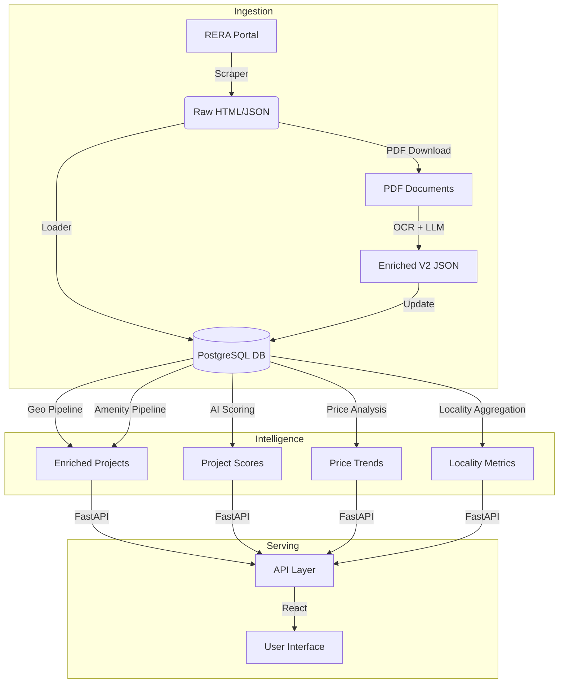

# System Architecture

**Version:** 2.0.0  
**Date:** 2026-01-02  
**Status:** Live / Implemented

---

## 1. High-Level Overview

RealMap uses a modern ETL (Extract-Transform-Load) pipeline feeding into a high-performance web application, augmented by an AI Intelligence Layer.

### Core Components
1.  **Scraper Engine:** Playwright-based crawler that navigates the CG RERA portal, extracting listings and PDF documents.
2.  **Database:** PostgreSQL 14+ acting as the central truth. Stores raw payloads, normalized relations, and geospatial data (PostGIS).
3.  **Intelligence Engine:**
    *   **Geo:** Normalizes addresses and fetches Lat/Lon via Nominatim/Google.
    *   **Amenities:** Aggregates nearby POIs (schools, hospitals) and computes "Quality Scores".
    *   **AI:** Vectorizes project descriptions for semantic search and computes "Trust Scores".
    *   **Market Analysis:** Computes price trends and locality averages.
4.  **API Gateway:** A FastAPI Service offering REST endpoints for the frontend.
5.  **Frontend:** A React+Vite Single Page Application (SPA) utilizing Leaflet for maps.

---

## 2. Directory Structure

| Path | Purpose |
| :--- | :--- |
| `cg_rera_extractor/` | Core Python package. |
| `cg_rera_extractor/browser/` | Playwright session management & CAPTCHA handling. |
| `cg_rera_extractor/parsing/` | Logic to map Raw HTML -> V1 JSON Schema. |
| `cg_rera_extractor/db/` | SQLAlchemy models (`models.py`, `models_enhanced.py`, `models_discovery.py`). |
| `cg_rera_extractor/api/` | FastAPI routes, schemas, and service layer. |
| `ai/` | AI microservices (Scoring, Chat, Anomaly Detection). |
| `airflow/` | Airflow DAGs for production orchestration. |
| `frontend/src/` | React source code (Components, Hooks, Pages). |
| `tools/` | CLI scripts for ETL, QA, PDF processing, and Analysis. |

---

## 3. Data Flow

1.  **Ingest:** `python -m cg_rera_extractor.cli` runs the scraper. Artifacts saved to `runs/`.
2.  **Load:** `loader.load_run_into_db` inserts data into `projects` table.
3.  **PDF Extract:** `tools/process_pdfs.py` runs OCR + LLM extraction on downloaded PDFs.
4.  **Enrichment (Batch Jobs):**
    *   `tools/geocode_projects.py`: Adds lat/lon.
    *   `tools/compute_project_scores.py`: Computes amenity/location scores.
    *   `scripts/seed_localities.py`: Aggregates projects into localities.
    *   `scripts/sync_project_pricing.py`: Updates price trends.
5.  **Serve:** API reads from `projects`, `project_scores`, `localities` tables to serve the UI.

---

## 4. Environment Strategy

*   **Local:** Dockerized DB, local Python venv, local Node server.
*   **Production:** Containerized services (API, UI, DB) orchestrated via Docker Compose or K8s.
*   **Orchestration:** Airflow manages the dependency graph of batch jobs.

---

## 5. Related Documents
- [Data Model](./Data_Model.md)
- [Scraper Pipeline](./Scraper_Pipeline.md)
- [API Reference](./API_Reference.md)
- [Orchestration Reference](./orchestration/orchestration_overview.md)

