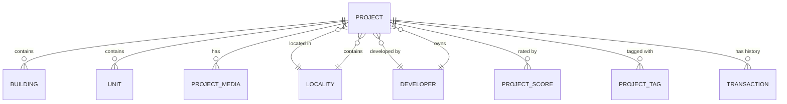

# Data Model

**Version:** 2.0.0  
**Date:** 2026-01-02  
**Status:** Live / Implemented

---

## 1. Overview

The RealMap database schema is built on **PostgreSQL** with **PostGIS** for geospatial features. It uses **SQLAlchemy** as the ORM layer.

The schema is modularized into three domains:
1.  **Core Models** (`models.py`): Foundational entities (Projects, Buildings, Units).
2.  **Enhanced Models** (`models_enhanced.py`): Richer attributes (Developers, Amenities, Transactions).
3.  **Discovery Models** (`models_discovery.py`): Search, SEO, and Trust features (Localities, Tags, Landmarks).

---

## 2. Core Domain (`models.py`)

### `projects`
The central entity representing a RERA registration.
*   `id` (PK): Integer.
*   `rera_registration_number`: Unique RERA ID (e.g., `PCGRERA...`).
*   `project_name`: Name as registered.
*   `listing_type`: `new_launch` | `under_construction` | `ready_to_move`.
*   `property_type`: `apartment` | `villa` | `plot` | `commercial`.
*   `slug`: SEO-friendly URL slug.
*   `locality_id` (FK): Link to `localities`.
*   `latitude` / `longitude`: Geolocation.
*   `qa_status`: Automated QA gate status.

### `parent_projects`
Groups multiple RERA registrations (phases) under one canonical project.
*   `id` (PK)
*   `name`: Canonical name.
*   `slug`: Canonical slug.

### `buildings`
Physical towers or blocks within a project.
*   `project_id` (FK)
*   `building_name`: Tower name (e.g., "Block A").
*   `number_of_floors`: Total floors.
*   `height_meters`: Physical height.

### `unit_types` & `project_unit_types`
Configuration templates (e.g., "3BHK Type A").
*   `unit_label`: Display name.
*   `bedrooms`, `bathrooms`, `balcony_count`.
*   `carpet_area_sqmt`: Net usable area.
*   `super_builtup_area_min_sqft`: Saleable area.

### `units`
Individual inventory items (specific flats/plots).
*   `unit_no`: Flat number (e.g., "101").
*   `floor_no`: Floor number.
*   `status`: `Available` | `Sold` | `Booked`.

### `project_media`
Rich media assets.
*   `media_category`: `gallery` | `floor_plan` | `video` | `virtual_tour`.
*   `url`: CDN URL.
*   `is_primary`: Main display image.

---

## 3. Enhanced Domain (`models_enhanced.py`)

### `developers`
First-class developer entities with track records.
*   `name`: Developer brand name.
*   `trust_score`: Calculated reliability score (0-10).
*   `total_delivered_sqft`: Historical volume.

### `project_amenities`
Detailed amenity mapping.
*   `amenity_type_id` (FK): Link to `amenity_types`.
*   `is_chargeable`: Boolean.
*   `quantity`: Count (e.g., 2 pools).

### `transaction_history`
Registry records for price verification.
*   `registry_number`: Official deed number.
*   `price_per_sqft_registered`: Actual transaction price.
*   `anonymized_buyer_hash`: Privacy-preserving ID.

### `project_possession_timelines`
Structured timeline tracking.
*   `marketing_target`: Promised date.
*   `rera_deadline`: Legal deadline.
*   `delay_months`: Calculated slippage.

---

## 4. Discovery Domain (`models_discovery.py`)

### `localities`
Hierarchical location entities (District -> Tehsil -> Neighborhood).
*   `slug`: URL identifier (e.g., `shankar-nagar-raipur`).
*   `locality_type`: `DISTRICT` | `TEHSIL` | `NEIGHBORHOOD`.
*   `pincode`: Postal code.

### `tags` & `project_tags`
Faceted search attributes.
*   `slug`: Tag ID (e.g., `metro-connected`).
*   `category`: `PROXIMITY` | `LIFESTYLE` | `INVESTMENT`.
*   `is_auto_generated`: True if computed by system.

### `landmarks`
Points of interest for "Near Me" search.
*   `name`: Landmark name (e.g., "Phoenix Mall").
*   `category`: `mall` | `tech_park` | `station`.
*   `importance_score`: Weight for ranking.

### `rera_verifications`
Trust badge history.
*   `status`: `VERIFIED` | `DISCREPANCY` | `EXPIRED`.
*   `official_record_url`: Link to government portal.

---

## 5. Intelligence & Operations

### `project_scores`
Computed quality metrics.
*   `overall_score`: 0-100 composite.
*   `lifestyle_score`: Based on amenities.
*   `connectivity_score`: Based on location/landmarks.
*   `safety_score`: Based on features.

### `project_pricing_snapshots`
Time-series pricing data.
*   `snapshot_date`: Date of observation.
*   `min_price_per_sqft`: Low range.
*   `max_price_per_sqft`: High range.

### `data_provenance`
Audit trail for every data point.
*   `source_url`: Origin.
*   `extraction_method`: Scraper/Parser version.
*   `confidence_score`: AI confidence.

### `project_embeddings`
Vector embeddings for semantic search.
*   `embedding_data`: JSON array (vector).
*   `model_name`: LLM used (e.g., `all-MiniLM-L6-v2`).

---

## 6. Entity Relationship Diagram (Simplified)

