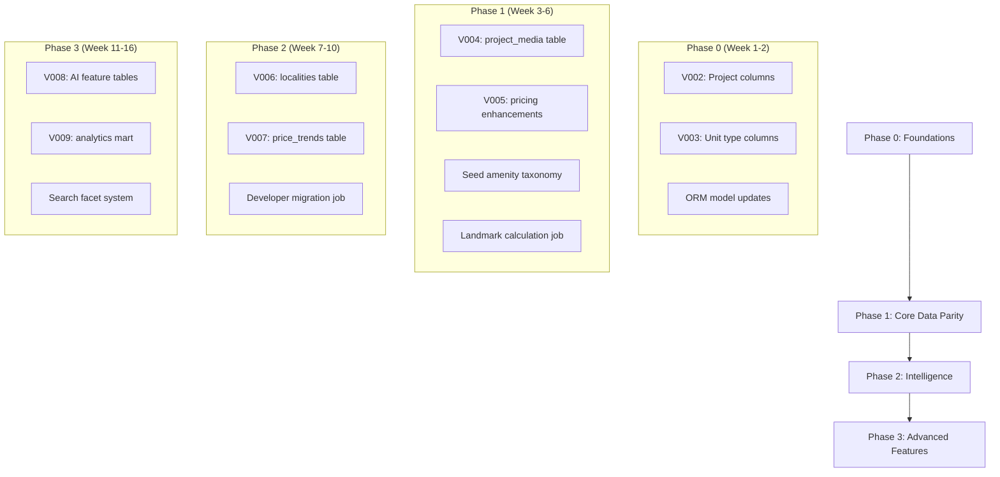

# [DEPRECATED] Schema Evolution Implementation Plan

> **Note:** This plan has been implemented. See `docs/02-technical/Data_Model.md` for the current schema.

## RealMap → 99acres-Level Data Richness

**Document Version:** 1.0  
**Date:** January 2, 2026  
**Author:** Principal Software Architect & Data Platform Lead  
**Status:** Draft for Engineering Review

---

## Executive Summary

This document outlines a **phased, backward-compatible implementation plan** to evolve RealMap's RERA-focused schema to achieve 99acres-level data richness. The plan prioritizes:

1. **Zero breaking changes** to existing APIs and consumers
2. **Additive schema modifications** with careful nullable defaults
3. **Incremental value delivery** through well-defined phases
4. **Production-grade data quality** across all new entities

### Current State Summary

| Metric | Current | Target | Gap |
|:---|:---:|:---:|:---:|
| Total Tables | 41 | ~55 | +14 |
| 99acres Field Coverage | 46% | 85%+ | +39% |
| Active/Populated Tables | 17 | 35+ | +18 |
| Media Management | ⚠️ Partial | ✅ Full | 🔴 Critical |
| Pricing Intelligence | ⚠️ Empty | ✅ Active | 🔴 Critical |
| Amenity Taxonomy | ⚠️ Empty | ✅ Populated | 🟡 High |
| Proximity/Landmarks | ⚠️ Empty | ✅ Populated | 🟡 High |

### Strengths to Preserve

- ✅ **RERA Compliance Core**: Complete regulatory data capture
- ✅ **Data Provenance**: Full audit trail and trust layer
- ✅ **AI/ML Infrastructure**: Embeddings, scoring, imputation
- ✅ **Operational Maturity**: QA gates, ingestion audits
- ✅ **Granular Hierarchy**: Project → Building → Unit

---

## Phase 0: Foundations (Safe Changes)

> **Duration:** 1 Sprint (2 weeks)  
> **Risk Level:** 🟢 Low  
> **Breaking Changes:** None

### Objectives

1. Add additive-only fields to existing tables
2. Prepare infrastructure for new entities
3. Ensure all changes are nullable and backward-compatible

### 0.1 Projects Table Enhancements

**Table:** `projects`

| New Column | Data Type | Nullable | Default | Purpose |
|:---|:---|:---:|:---:|:---|
| `listing_type` | `VARCHAR(30)` | ✅ | `NULL` | "new_launch" / "under_construction" / "ready_to_move" |
| `property_type` | `VARCHAR(50)` | ✅ | `NULL` | Normalized: "apartment" / "villa" / "plot" / "commercial" |
| `view_count` | `INTEGER` | ✅ | `0` | Analytics tracking |
| `featured_at` | `TIMESTAMP` | ✅ | `NULL` | Featured listing promotion |
| `meta_description` | `TEXT` | ✅ | `NULL` | SEO description |
| `slug` | `VARCHAR(200)` | ✅ | `NULL` | SEO-friendly URL component |

**Index Recommendations:**
```sql
CREATE INDEX ix_projects_listing_type ON projects(listing_type);
CREATE INDEX ix_projects_property_type ON projects(property_type);
CREATE UNIQUE INDEX ix_projects_slug ON projects(slug) WHERE slug IS NOT NULL;
```

### 0.2 Unit Type Pricing Extensions

**Table:** `project_unit_types`

| New Column | Data Type | Nullable | Purpose |
|:---|:---|:---:|:---|
| `base_price_inr` | `NUMERIC(14,2)` | ✅ | Starting price for this configuration |
| `price_per_sqft_carpet` | `NUMERIC(10,2)` | ✅ | Price per sq ft (carpet area) |
| `price_per_sqft_super` | `NUMERIC(10,2)` | ✅ | Price per sq ft (super built-up) |
| `floor_plan_image_url` | `VARCHAR(1024)` | ✅ | Direct link to floor plan image |
| `has_3d_view` | `BOOLEAN` | ✅ | 3D tour availability flag |

### 0.3 Calculated Charges (Projects)

**Table:** `projects`

| New Column | Data Type | Nullable | Purpose |
|:---|:---|:---:|:---|
| `stamp_duty_rate` | `NUMERIC(5,2)` | ✅ | State stamp duty % (default: 7.0 for CG) |
| `registration_rate` | `NUMERIC(5,2)` | ✅ | Registration % (default: 1.0 for CG) |
| `gst_applicable` | `BOOLEAN` | ✅ | GST applicability flag |
| `gst_rate` | `NUMERIC(5,2)` | ✅ | Applicable GST % |

### 0.4 Migration Strategy

```sql
-- Phase 0 Migration (All additive, non-breaking)
-- V002_phase0_foundations.sql

ALTER TABLE projects ADD COLUMN IF NOT EXISTS listing_type VARCHAR(30);
ALTER TABLE projects ADD COLUMN IF NOT EXISTS property_type VARCHAR(50);
ALTER TABLE projects ADD COLUMN IF NOT EXISTS view_count INTEGER DEFAULT 0;
ALTER TABLE projects ADD COLUMN IF NOT EXISTS featured_at TIMESTAMP WITH TIME ZONE;
ALTER TABLE projects ADD COLUMN IF NOT EXISTS meta_description TEXT;
ALTER TABLE projects ADD COLUMN IF NOT EXISTS slug VARCHAR(200);
ALTER TABLE projects ADD COLUMN IF NOT EXISTS stamp_duty_rate NUMERIC(5,2) DEFAULT 7.0;
ALTER TABLE projects ADD COLUMN IF NOT EXISTS registration_rate NUMERIC(5,2) DEFAULT 1.0;
ALTER TABLE projects ADD COLUMN IF NOT EXISTS gst_applicable BOOLEAN;
ALTER TABLE projects ADD COLUMN IF NOT EXISTS gst_rate NUMERIC(5,2);

ALTER TABLE project_unit_types ADD COLUMN IF NOT EXISTS base_price_inr NUMERIC(14,2);
ALTER TABLE project_unit_types ADD COLUMN IF NOT EXISTS price_per_sqft_carpet NUMERIC(10,2);
ALTER TABLE project_unit_types ADD COLUMN IF NOT EXISTS price_per_sqft_super NUMERIC(10,2);
ALTER TABLE project_unit_types ADD COLUMN IF NOT EXISTS floor_plan_image_url VARCHAR(1024);
ALTER TABLE project_unit_types ADD COLUMN IF NOT EXISTS has_3d_view BOOLEAN DEFAULT FALSE;
```

### 0.5 Backward Compatibility Notes

- All new columns are nullable with sensible defaults
- Existing APIs continue to function without modification
- No data migration required (new columns start empty)
- ORM models updated with optional fields

---

## Phase 1: Core Data Parity

> **Duration:** 2 Sprints (4 weeks)  
> **Risk Level:** 🟡 Medium  
> **Dependencies:** Phase 0 complete

### Objectives

1. Implement critical missing functionality for consumer-facing features
2. Populate existing empty tables with real data
3. Achieve 70% field coverage vs 99acres

### 1.1 Media Management System

**NEW TABLE:** `project_media`

| Column | Data Type | Nullable | Purpose |
|:---|:---|:---:|:---|
| `id` | `SERIAL` | ❌ | Primary key |
| `project_id` | `INTEGER` | ❌ | FK → projects |
| `media_type` | `VARCHAR(30)` | ❌ | "photo" / "video" / "virtual_tour" / "drone" |
| `category` | `VARCHAR(50)` | ✅ | "exterior" / "interior" / "amenity" / "floor_plan" |
| `url` | `VARCHAR(1024)` | ❌ | CDN or S3 URL |
| `thumbnail_url` | `VARCHAR(1024)` | ✅ | Thumbnail for galleries |
| `title` | `VARCHAR(255)` | ✅ | Caption/title |
| `alt_text` | `VARCHAR(255)` | ✅ | Accessibility |
| `sort_order` | `INTEGER` | ✅ | Display ordering |
| `is_primary` | `BOOLEAN` | ✅ | Primary image flag |
| `width` | `INTEGER` | ✅ | Image dimensions |
| `height` | `INTEGER` | ✅ | Image dimensions |
| `file_size_bytes` | `INTEGER` | ✅ | Storage tracking |
| `source_document_id` | `INTEGER` | ✅ | FK → project_documents (provenance) |
| `created_at` | `TIMESTAMPTZ` | ❌ | Audit |
| `updated_at` | `TIMESTAMPTZ` | ✅ | Audit |

**Indexes:**
```sql
CREATE INDEX ix_project_media_project_id ON project_media(project_id);
CREATE INDEX ix_project_media_type ON project_media(media_type);
CREATE INDEX ix_project_media_primary ON project_media(project_id, is_primary) WHERE is_primary = TRUE;
```

**Data Population Strategy:**
1. Extract image/video URLs from `project_documents` where `doc_type` matches media patterns
2. Parse `project_artifacts.floor_plan_data` for floor plan images
3. Run image processing job to generate thumbnails and extract dimensions

### 1.2 Pricing Snapshots Population

**Table:** `project_pricing_snapshots` (Existing - Empty)

**Population Strategy:**
1. **Immediate:** Parse `raw_data_json` from `projects` for any pricing hints
2. **Manual Entry UI:** Build admin interface for price data entry
3. **Scraper Enhancement:** Add pricing extraction from RERA portal updates
4. **Historical Backfill:** Create baseline snapshots for all projects with `snapshot_date = scraped_at`

**Required Enhancements:**

| New Column | Data Type | Purpose |
|:---|:---|:---|
| `unit_type_label` | `VARCHAR(50)` | Link to specific unit configuration |
| `price_source` | `VARCHAR(30)` | "rera" / "manual" / "scraped" |
| `currency_code` | `VARCHAR(3)` | Default "INR" |

### 1.3 Amenity Taxonomy Population

**Tables:** `amenity_categories`, `amenities`, `amenity_types`, `project_amenities` (Existing - Empty)

**Population Strategy:**

1. **Seed Reference Data:**
```sql
-- Seed amenity_categories
INSERT INTO amenity_categories (name, code, score_weight) VALUES
('Health & Fitness', 'HEALTH', 2.5),
('Recreation', 'RECREATION', 2.0),
('Security', 'SECURITY', 3.0),
('Convenience', 'CONVENIENCE', 1.5),
('Luxury', 'LUXURY', 1.0);

-- Seed amenities
INSERT INTO amenities (category_id, name, code, is_premium) VALUES
((SELECT id FROM amenity_categories WHERE code='HEALTH'), 'Swimming Pool', 'POOL', FALSE),
((SELECT id FROM amenity_categories WHERE code='HEALTH'), 'Gymnasium', 'GYM', FALSE),
((SELECT id FROM amenity_categories WHERE code='HEALTH'), 'Yoga Deck', 'YOGA', FALSE),
((SELECT id FROM amenity_categories WHERE code='SECURITY'), 'CCTV Surveillance', 'CCTV', FALSE),
((SELECT id FROM amenity_categories WHERE code='SECURITY'), 'Gated Community', 'GATED', FALSE),
-- ... (full taxonomy in seed script)
```

2. **Extraction Pipeline:**
   - Parse `projects.raw_data_json` for amenity mentions
   - NLP-based extraction from `document_extractions.raw_text`
   - Map extracted strings to canonical amenity codes

### 1.4 Landmarks & Proximity

**Tables:** `landmarks`, `project_landmarks` (Existing - Empty)

**Population Strategy:**

1. **Promote from amenity_poi:**
   - Query `amenity_poi` for high-importance POIs (malls, metros, hospitals)
   - Insert as `landmarks` with proper categorization

2. **Distance Calculation Job:**
   - For each project with valid coordinates
   - Calculate Haversine distance to all landmarks within 10km
   - Insert into `project_landmarks` with `distance_km` and `travel_time_minutes`

```python
# Pseudocode for landmark calculation job
for project in projects_with_coordinates:
    nearby_landmarks = landmarks.filter(distance(project.coords, landmark.coords) < 10)
    for landmark in nearby_landmarks:
        distance = haversine(project.coords, landmark.coords)
        travel_time = estimate_travel_time(distance, landmark.type)
        insert_project_landmark(project_id, landmark_id, distance, travel_time)
```

### 1.5 Construction Progress Tracking

**Table:** `project_possession_timelines` (Existing - Empty)

**Population Strategy:**
1. Parse quarterly update PDFs for milestone dates
2. Extract from `rera_filings` structured data
3. Compare `proposed_start_date` vs `proposed_end_date` in `projects`

**Required Enhancements:**

| Column | Data Type | Purpose |
|:---|:---|:---|
| `tower_name` | `VARCHAR(100)` | Per-tower timeline if applicable |
| `milestone_type` | `VARCHAR(50)` | "foundation" / "structure" / "finishing" / "oc_received" |
| `scheduled_date` | `DATE` | Original planned date |
| `actual_date` | `DATE` | Actual completion date |
| `delay_days` | `INTEGER` | Computed delay |
| `delay_reason` | `TEXT` | Developer-provided reason |

### 1.6 Impacted Tables Summary

| Table | Action | Row Estimate |
|:---|:---|:---:|
| `project_media` | NEW | ~2,000 |
| `project_pricing_snapshots` | POPULATE | ~300 |
| `amenity_categories` | SEED | ~10 |
| `amenities` | SEED | ~50 |
| `project_amenities` | POPULATE | ~1,500 |
| `landmarks` | POPULATE | ~200 |
| `project_landmarks` | CALCULATE | ~5,000 |
| `project_possession_timelines` | POPULATE | ~300 |

---

## Phase 2: Intelligence & Insights

> **Duration:** 2 Sprints (4 weeks)  
> **Risk Level:** 🟡 Medium  
> **Dependencies:** Phase 1 complete

### Objectives

1. Enable price trend analysis and investment insights
2. Build locality-level aggregations for SEO and discovery
3. Implement developer track record scoring

### 2.1 Price Trend Analytics

**NEW TABLE:** `price_trends`

| Column | Data Type | Nullable | Purpose |
|:---|:---|:---:|:---|
| `id` | `SERIAL` | ❌ | Primary key |
| `project_id` | `INTEGER` | ❌ | FK → projects |
| `period_type` | `VARCHAR(20)` | ❌ | "monthly" / "quarterly" / "yearly" |
| `period_start` | `DATE` | ❌ | Start of period |
| `period_end` | `DATE` | ❌ | End of period |
| `avg_price_per_sqft` | `NUMERIC(10,2)` | ✅ | Average during period |
| `min_price_per_sqft` | `NUMERIC(10,2)` | ✅ | Minimum |
| `max_price_per_sqft` | `NUMERIC(10,2)` | ✅ | Maximum |
| `change_pct` | `NUMERIC(6,2)` | ✅ | Period-over-period % change |
| `trend_direction` | `VARCHAR(10)` | ✅ | "up" / "down" / "stable" |
| `sample_count` | `INTEGER` | ✅ | Number of data points |
| `computed_at` | `TIMESTAMPTZ` | ❌ | Job timestamp |

**Computation Job:**
- Aggregate from `project_pricing_snapshots`
- Run weekly as scheduled job
- Publish to API for frontend charts

### 2.2 Locality Intelligence

**NEW TABLE:** `localities`

| Column | Data Type | Nullable | Purpose |
|:---|:---|:---:|:---|
| `id` | `SERIAL` | ❌ | Primary key |
| `name` | `VARCHAR(255)` | ❌ | Locality name |
| `slug` | `VARCHAR(255)` | ❌ | SEO-friendly identifier |
| `city` | `VARCHAR(100)` | ✅ | Parent city |
| `district` | `VARCHAR(100)` | ✅ | Administrative district |
| `state_code` | `VARCHAR(10)` | ✅ | State identifier |
| `polygon_geojson` | `JSONB` | ✅ | Boundary polygon |
| `centroid_lat` | `NUMERIC(9,6)` | ✅ | Center point |
| `centroid_lng` | `NUMERIC(9,6)` | ✅ | Center point |
| `description` | `TEXT` | ✅ | SEO content |
| `avg_price_per_sqft` | `NUMERIC(10,2)` | ✅ | Aggregated metric |
| `total_projects` | `INTEGER` | ✅ | Project count |
| `avg_connectivity_score` | `NUMERIC(4,2)` | ✅ | From project_scores |
| `avg_lifestyle_score` | `NUMERIC(4,2)` | ✅ | From project_scores |
| `avg_safety_score` | `NUMERIC(4,2)` | ✅ | From project_scores |
| `last_computed_at` | `TIMESTAMPTZ` | ✅ | Job timestamp |
| `created_at` | `TIMESTAMPTZ` | ❌ | Audit |
| `updated_at` | `TIMESTAMPTZ` | ✅ | Audit |

**Link to Projects:**
```sql
ALTER TABLE projects ADD COLUMN locality_id INTEGER REFERENCES localities(id);
CREATE INDEX ix_projects_locality_id ON projects(locality_id);
```

### 2.3 Developer Track Records

**Populate:** `developers`, `developer_projects` (Existing - Empty)

**Computed Columns for `developers`:**

| Column | Data Type | Purpose |
|:---|:---|:---|
| `total_projects` | `INTEGER` | Count from developer_projects |
| `completed_projects` | `INTEGER` | Count where status='completed' |
| `avg_delay_days` | `NUMERIC(6,1)` | Historical average delay |
| `trust_score` | `NUMERIC(4,2)` | Computed trust rating |
| `verified` | `BOOLEAN` | Manual verification flag |

**Migration from Promoters:**
```python
# Pseudocode for promoter → developer migration
for promoter in promoters:
    developer = find_or_create_developer(promoter.promoter_name)
    create_developer_project(developer.id, promoter.project_id, role='primary')
```

### 2.4 Ratings & Reviews Foundation

**NEW TABLE:** `locality_reviews`

| Column | Data Type | Nullable | Purpose |
|:---|:---|:---:|:---|
| `id` | `SERIAL` | ❌ | Primary key |
| `locality_id` | `INTEGER` | ❌ | FK → localities |
| `user_id` | `INTEGER` | ✅ | FK → users (if user system exists) |
| `rating` | `NUMERIC(2,1)` | ❌ | 1.0 - 5.0 scale |
| `category` | `VARCHAR(30)` | ✅ | "connectivity" / "safety" / "lifestyle" |
| `review_text` | `TEXT` | ✅ | Optional comment |
| `status` | `VARCHAR(20)` | ❌ | "pending" / "approved" / "rejected" |
| `moderated_at` | `TIMESTAMPTZ` | ✅ | Moderation timestamp |
| `created_at` | `TIMESTAMPTZ` | ❌ | Audit |

> [!IMPORTANT]
> `locality_reviews` requires user authentication system. Implement only after user accounts are available.

---

## Phase 3: Advanced Features

> **Duration:** 3 Sprints (6 weeks)  
> **Risk Level:** 🟠 Medium-High  
> **Dependencies:** Phase 2 complete

### Objectives

1. AI-readiness for recommendation engines
2. Search optimization with faceted filtering
3. Analytics-ready data structures

### 3.1 Recommendation Engine Readiness

**NEW TABLE:** `user_preferences`

| Column | Data Type | Purpose |
|:---|:---|:---|
| `id` | `SERIAL` | Primary key |
| `user_id` | `INTEGER` | FK → users |
| `preferred_localities` | `INTEGER[]` | Array of locality IDs |
| `preferred_bhk_types` | `VARCHAR[]` | ["2 BHK", "3 BHK"] |
| `min_budget` | `NUMERIC(14,2)` | Budget floor |
| `max_budget` | `NUMERIC(14,2)` | Budget ceiling |
| `preferred_amenities` | `INTEGER[]` | Array of amenity IDs |
| `preferred_developers` | `INTEGER[]` | Array of developer IDs |
| `embedding` | `vector(384)` | User preference embedding |
| `updated_at` | `TIMESTAMPTZ` | Last update |

**NEW TABLE:** `project_interactions`

| Column | Data Type | Purpose |
|:---|:---|:---|
| `id` | `SERIAL` | Primary key |
| `user_id` | `INTEGER` | FK → users |
| `project_id` | `INTEGER` | FK → projects |
| `interaction_type` | `VARCHAR(30)` | "view" / "shortlist" / "share" / "contact" |
| `duration_seconds` | `INTEGER` | Time spent (for views) |
| `created_at` | `TIMESTAMPTZ` | Timestamp |

### 3.2 Search Optimization

**Enhance:** `project_embeddings` (Existing - Empty)

| Enhancement | Description |
|:---|:---|
| HNSW Index | Add `CREATE INDEX ON project_embeddings USING hnsw (embedding vector_cosine_ops)` |
| Content Sources | Generate embeddings from: project name, description, amenities, locality |
| Refresh Cadence | Nightly batch job |

**NEW TABLE:** `search_facets`

| Column | Data Type | Purpose |
|:---|:---|:---|
| `id` | `SERIAL` | Primary key |
| `facet_type` | `VARCHAR(50)` | "bhk" / "price_range" / "locality" / "amenity" / "status" |
| `facet_value` | `VARCHAR(100)` | Normalized value |
| `display_label` | `VARCHAR(100)` | User-facing label |
| `project_count` | `INTEGER` | Live count |
| `is_active` | `BOOLEAN` | Visibility flag |
| `sort_order` | `INTEGER` | Display ordering |
| `last_computed_at` | `TIMESTAMPTZ` | Job timestamp |

**Facet Computation Job:**
- Aggregate counts per facet from live data
- Run hourly for real-time accuracy
- Cache results for API performance

### 3.3 AI-Ready Vectorizable Fields

**Table:** `project_ai_features`

| Column | Data Type | Purpose |
|:---|:---|:---|
| `id` | `SERIAL` | Primary key |
| `project_id` | `INTEGER` | FK → projects |
| `feature_vector` | `vector(128)` | Compressed feature embedding |
| `text_embedding` | `vector(384)` | Description embedding |
| `image_embedding` | `vector(512)` | Primary image embedding |
| `structured_features` | `JSONB` | Normalized numeric features |
| `computed_at` | `TIMESTAMPTZ` | Job timestamp |

**Structured Features Schema:**
```json
{
  "price_normalized": 0.65,
  "area_normalized": 0.45,
  "bhk_encoded": [1, 0, 0, 0],
  "amenity_vector": [1, 1, 0, 1, 0, ...],
  "locality_encoded": 42,
  "developer_trust": 0.85,
  "delay_risk": 0.12
}
```

### 3.4 Analytics Mart

**NEW TABLE:** `project_daily_stats`

| Column | Data Type | Purpose |
|:---|:---|:---|
| `id` | `SERIAL` | Primary key |
| `project_id` | `INTEGER` | FK → projects |
| `stat_date` | `DATE` | Aggregation date |
| `view_count` | `INTEGER` | Daily views |
| `shortlist_count` | `INTEGER` | Daily shortlists |
| `contact_count` | `INTEGER` | Daily contact requests |
| `search_impressions` | `INTEGER` | Search result appearances |
| `search_clicks` | `INTEGER` | Clicks from search |
| `ctr` | `NUMERIC(5,4)` | Click-through rate |

**Partitioning Strategy:**
```sql
CREATE TABLE project_daily_stats (
    ...
) PARTITION BY RANGE (stat_date);

CREATE TABLE project_daily_stats_2026_01 PARTITION OF project_daily_stats
    FOR VALUES FROM ('2026-01-01') TO ('2026-02-01');
```

---

## Migration Execution Plan

### Pre-Migration Checklist

- [ ] Full database backup verified
- [ ] Staging environment mirrored
- [ ] ORM models updated
- [ ] API versioning strategy confirmed
- [ ] Rollback scripts tested
- [ ] Performance baseline established

### Execution Order



### Rollback Plan

Each migration includes a corresponding rollback script:

| Migration | Rollback Command |
|:---|:---|
| V002 | `ALTER TABLE projects DROP COLUMN IF EXISTS listing_type, ...` |
| V003 | `ALTER TABLE project_unit_types DROP COLUMN IF EXISTS base_price_inr, ...` |
| V004 | `DROP TABLE IF EXISTS project_media CASCADE` |

> [!CAUTION]
> Data loss warning: Rollback after data population will result in permanent data loss. Always backup before rollback.

---

## API Versioning Strategy

### Approach: Additive Evolution

1. **No breaking changes** to v1 endpoints
2. New fields added to existing responses (nullable)
3. New endpoints for new functionality
4. Deprecation warnings for legacy patterns

### Version Timeline

| Version | Status | Changes |
|:---|:---|:---|
| v1 | **Active** | Current API, maintained for backward compatibility |
| v1.1 | Planned | Add media, pricing, amenity fields to existing responses |
| v1.2 | Planned | Add locality endpoints, price trends |
| v2 | Future | Breaking changes (if any), after deprecation period |

### Example: Enhanced Project Response

```json
{
  "id": 1,
  "project_name": "Lotus Meadows",
  "rera_registration_number": "PCGRERA...",
  
  // Existing fields (unchanged)
  "status": "approved",
  "latitude": 21.1234,
  "longitude": 81.1234,
  
  // NEW in v1.1 (additive, nullable)
  "listing_type": "under_construction",
  "property_type": "apartment",
  "stamp_duty_rate": 7.0,
  
  // NEW nested objects
  "media": {
    "primary_image": "https://...",
    "photo_count": 12,
    "video_count": 2,
    "has_3d_tour": true
  },
  "pricing": {
    "min_price": 4500000,
    "max_price": 7200000,
    "price_per_sqft": 4200,
    "last_updated": "2026-01-01"
  },
  "amenities": ["swimming_pool", "gymnasium", "cctv"],
  "nearby_landmarks": [
    {"name": "Phoenix Mall", "distance_km": 2.5, "travel_time_min": 8}
  ]
}
```

---

## Risk Assessment & Mitigations

### Risk Matrix

| Risk | Probability | Impact | Mitigation |
|:---|:---:|:---:|:---|
| Schema bloat | Medium | Medium | Phase-based delivery, unused column cleanup |
| Performance degradation | Low | High | Index optimization, query analysis before/after |
| Data inconsistency | Medium | High | Validation jobs, constraint enforcement |
| API breaking changes | Low | Critical | Strict additive-only policy |
| Backfill job failures | Medium | Medium | Retry logic, partial commit support |
| Storage growth | High | Low | Archival strategy, partition pruning |

### Monitoring Checklist

- [ ] Query performance dashboards
- [ ] Table size growth alerts
- [ ] Index usage statistics
- [ ] API response time tracking
- [ ] Data quality job monitoring

---

## Success Metrics

| Metric | Current | Phase 1 Target | Phase 3 Target |
|:---|:---:|:---:|:---:|
| 99acres Field Coverage | 46% | 70% | 85% |
| Tables with Data | 17/41 | 25/41 | 35/55 |
| Avg Project Photos | 0 | 5+ | 10+ |
| Projects with Pricing | 0% | 50% | 80% |
| Amenity Normalization | 0% | 60% | 90% |
| Landmark Proximity Data | 0% | 70% | 95% |

---

## Appendix A: Full Table Inventory Post-Implementation

| Table | Status | Phase |
|:---|:---|:---:|
| projects | Enhanced | 0 |
| project_unit_types | Enhanced | 0 |
| project_media | NEW | 1 |
| project_pricing_snapshots | Populated | 1 |
| amenity_categories | Seeded | 1 |
| amenities | Seeded | 1 |
| project_amenities | Populated | 1 |
| landmarks | Populated | 1 |
| project_landmarks | Calculated | 1 |
| project_possession_timelines | Populated | 1 |
| localities | NEW | 2 |
| price_trends | NEW | 2 |
| developers | Migrated | 2 |
| developer_projects | Migrated | 2 |
| locality_reviews | NEW | 2 |
| user_preferences | NEW | 3 |
| project_interactions | NEW | 3 |
| search_facets | NEW | 3 |
| project_ai_features | NEW | 3 |
| project_daily_stats | NEW | 3 |

---

*Document Version: 1.0*  
*Last Updated: January 2, 2026*  
*Next Review: After Phase 0 completion*
