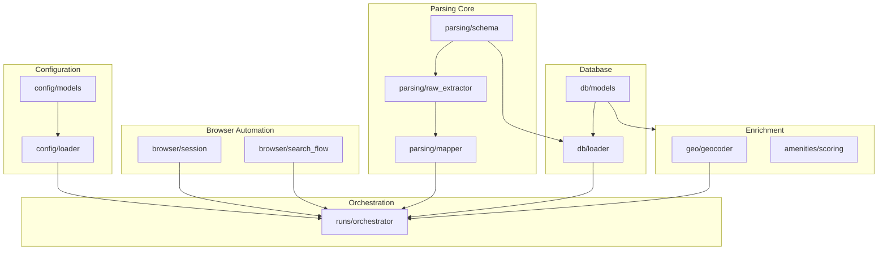

# 🔗 Dependency Graph

This document visualizes the dependencies between the various modules in the RealMap ecosystem.

## 🏛️ Module Dependency DAG

Key architectural layers and their directional dependencies:



## 📦 File-Level Imports (Critical Path)

The following tree highlights the critical import chain for the main extraction runner:

```text
runs/orchestrator.py
├── config/loader.py
├── browser/session.py
├── listing/scraper.py
├── detail/fetcher.py
├── detail/preview_capture.py
├── parsing/raw_extractor.py
├── parsing/mapper.py
├── geo/
│   ├── geocoder.py
│   └── location_selector.py
├── quality/validation.py
└── db/loader.py
    └── db/models.py
```

## 🔄 Cyclic Dependency Risks

*   **Risk Area**: `db/loader.py` imports `quality/validation.py`. Ensure `quality` does not import `db` logic to avoid cycles.
*   **Risk Area**: `ai/main.py` imports `db/models.py`. Ensure core `db` models do not depend on `ai` components.
