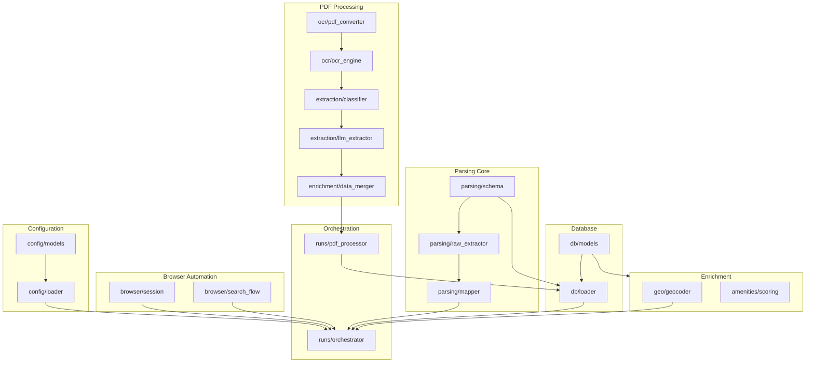

# 🔗 Dependency Graph

This document visualizes the dependencies between the various modules in the RealMap ecosystem.

## 🏛️ Module Dependency DAG

Key architectural layers and their directional dependencies:



## 📦 File-Level Imports (Critical Path)

The following tree highlights the critical import chain for the main extraction runner:

```text
runs/orchestrator.py
├── config/loader.py
├── browser/session.py
├── listing/scraper.py
├── detail/fetcher.py
├── detail/preview_capture.py
├── parsing/raw_extractor.py
├── parsing/mapper.py
├── geo/
│   ├── geocoder.py
│   └── location_selector.py
├── quality/validation.py
└── db/loader.py
    └── db/models.py
```

### PDF Processing Import Chain

```text
runs/pdf_processor.py
├── ocr/
│   ├── pdf_converter.py
│   │   └── (pdf2image, PIL)
│   ├── ocr_engine.py
│   │   └── (pytesseract, easyocr)
│   └── text_cleaner.py
├── extraction/
│   ├── document_classifier.py
│   ├── llm_extractor.py
│   │   └── ai/llm/adapter.py
│   └── schemas/*.py
├── enrichment/
│   ├── conflict_resolver.py
│   └── data_merger.py
└── db/loader.py
```

## 🔄 Cyclic Dependency Risks

*   **Risk Area**: `db/loader.py` imports `quality/validation.py`. Ensure `quality` does not import `db` logic to avoid cycles.
*   **Risk Area**: `ai/main.py` imports `db/models.py`. Ensure core `db` models do not depend on `ai` components.
