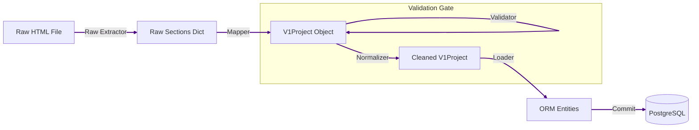

# ⚙️ Main Processing Layer

The Main Processing layer handles the **transformation** and **persistence** of data. It converts unstructured HTML into structured, typed, and validated records in the database.

## 🧩 Components

### 1. Parsing & Extraction
* **Raw Extractor**: `cg_rera_extractor/parsing/raw_extractor.py` - Breaks down the complex detail HTML into logical sections (e.g., "Project Details", "Promoter Details").
* **Mapper**: `cg_rera_extractor/parsing/mapper.py` - Maps the raw sections to the strict `V1Project` Pydantic schema. This is where string cleaning and type conversion happens.
* **Schema**: `cg_rera_extractor/parsing/schema.py` - Defines the `V1Project` data structure, acting as the contract between scraping and loading.

### 2. Quality & Validation
* **Validation**: `cg_rera_extractor/quality/validation.py` - Implements business rules (e.g., "Price must be > 0", "Start Date < End Date").
* **Normalization**: `cg_rera_extractor/quality/normalization.py` - Standardizes addresses, names, and formats before DB insertion.

### 3. Database Loading
* **Loader**: `cg_rera_extractor/db/loader.py` - The bridge between JSON schemas and SQL Alchemy models. It handles upserts, relationship management, and transaction boundaries.
* **Models**: `cg_rera_extractor/db/models.py` - The SQL Alchemy ORM definitions mirroring the PostgreSQL schema.

## 🔄 Data Flow



## 🛠️ Execution Logic

1. **Extraction**: The `RawExtractedProject` intermediate structure captures the page "as-is".
2. **Mapping**: `map_raw_to_v1` applies heuristics to convert "10.5 Acres" -> `10.5` (float).
3. **QA Gate**: The system checks if the data looks "sane". Warnings are logged; Critical failures skip the load.
4. **Loading**:
    *   Find or Create Project (by RERA ID).
    *   Replace child collections (Buildings, Promoters).
    *   Create `DataProvenance` record for auditability.
    *   Commit transaction.

## 📂 Key Files

| File | Importance | Purpose |
|------|------------|---------|
| `cg_rera_extractor/parsing/mapper.py` | 🔴 Critical | Contains the logic for interpreting varied HTML formats. |
| `cg_rera_extractor/db/loader.py` | 🔴 Critical | Controls data integrity and DB write operations. |
| `cg_rera_extractor/db/models.py` | 🔵 Core | Source of truth for database structure. |

---

## ➡️ Next Step: PDF Processing

After main processing completes, run the **PDF Processing Layer** to extract additional structured data from downloaded PDF documents:

```bash
python tools/process_pdfs.py --page 1
```

See [PDF Processing](./pdf-processing.md) for full documentation.
