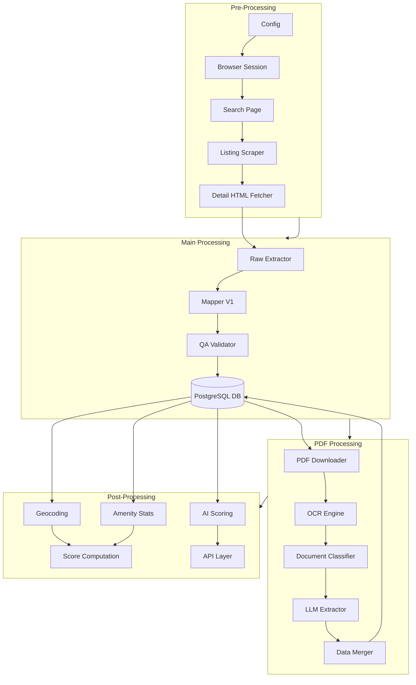

# 🎼 RealMap Orchestration

**Orchestration Analysis & Blueprint**

This section documents the complete orchestration flow of the RealMap platform, dividing the system into logical layers (`Pre-Processing`, `Main-Processing`, `Post-Processing`) and analyzing the execution graphs.

## 📚 Contents

1. **[Pre-Processing Layer](./preprocessing.md)**
   * Browser automation (Playwright)
   * CAPTCHA handling
   * Listing scraping & HTML acquisition
2. **[Main Processing Layer](./main_processing.md)**
   * Raw extraction & Schema mapping (V1 JSON)
   * QA Validation & Data Normalization
   * Database Loader
3. **[PDF Processing Layer](./pdf-processing.md)** ✨ NEW
   * OCR text extraction (Tesseract/EasyOCR)
   * Document classification (11 types)
   * LLM-based structured extraction
   * Data merging & enrichment (V2 JSON)
4. **[Post-Processing Layer](./post_processing.md)**
   * Geocoding & Amenity Enrichment
   * AI Scoring & Microservices
   * API Serving & Frontend
5. **[Dependency Graph](./dependency_graph.md)**
   * Module dependency visualization
   * Execution DAGs
6. **[Future Architecture](./future_architecture.md)**
   * Recommendations for moving to Airflow/Prefect
   * Proposed DAG designs
7. **[Unused Files Report](./unused_files.md)**
   * Audit of orphaned scripts and cleanup candidates

---

## 🏗️ High-Level Architecture

The RealMap pipeline operates as a sequence of localized transformations, orchestrated by **Apache Airflow** in production.

