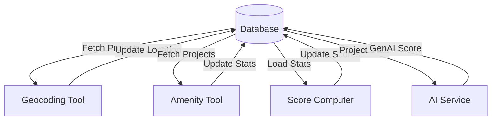

# 🚀 Post-Processing Layer

The Post-Processing layer is responsible for **enrichment**, **intelligence**, and **delivery**. It takes the structured data in the DB and adds value through third-party services, AI models, and API presentation.

## 🧩 Components

### 1. Enrichment Services
* **Geocoding**: `cg_rera_extractor/geo/geocoder.py` - Resolves addresses to Lat/Lon using Nominatim or Google Maps APIs. Includes caching and rate limiting.
* **Amenities**: `cg_rera_extractor/amenities/provider.py` - Fetches nearby POIs (Schools, Hospitals) from OSM/Google.
* **Scoring (Algorithmic)**: `cg_rera_extractor/amenities/scoring.py` - component calculating `amenity_score` and `location_score` based on deterministic rules (distance to POIs).

### 2. AI Intelligence (Microservice)
* **AI Service**: `ai/main.py` - A FastAPI microservice (Port 8001) handling specialized AI tasks.
* **Scoring (ML)**: `ai/scoring/logic.py` - Uses LLMs/ML to generate a "quality score" based on fuzzy features (description sentiment, builder reputation).
* **Chat Assistant**: `ai/chat/assistant.py` - Provides RAG (Retrieval Augmented Generation) capabilities over project data.

### 3. API & Serving
* **Main API**: `cg_rera_extractor/api/app.py` - The core FastAPI application (Port 8000).
* **Routes**: Individual modules (`routes_projects.py`, `routes_analytics.py`) exposing REST endpoints.
* **Middleware**: `cg_rera_extractor/api/middleware.py` - Handles security, CORS, and rate limiting.

## 🔄 Enrichment Pipeline

Post-processing tasks often run asynchronously or in batch mode after the main load is complete.

## 📂 Key Files

| File | Purpose |
|------|---------|
| `cg_rera_extractor/geo/geocoder.py` | Critical for map functionality. |
| `tools/compute_project_scores.py` | The batch job that updates project scores. |
| `tools/process_pdfs.py` | OCR + LLM extraction from PDF documents. |
| `ai/scoring/logic.py` | The "brain" of the AI assessment. |
| `cg_rera_extractor/api/routes_projects.py` | The primary endpoint consumed by the frontend. |

---

## 🔗 Prerequisites

Before running post-processing, ensure:
1. **Main Processing** completed (V1 JSON loaded to database)
2. **PDF Processing** completed (enriched V2 JSON available) - See [PDF Processing](./pdf-processing.md)
