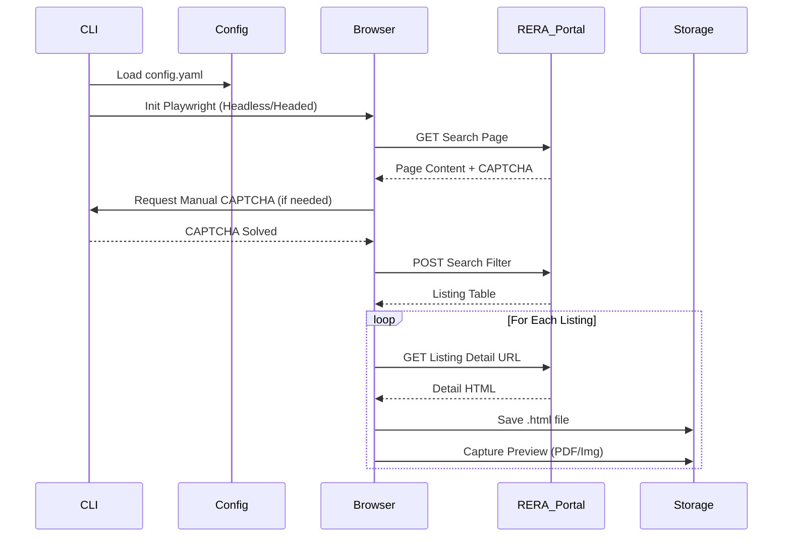

# 🏗️ Pre-Processing Layer

The Pre-Processing layer is responsible for the **acquisition** of raw data. It handles the interface with the external CG RERA portal, browser automation, and the storage of raw HTML artifacts.

## 🧩 Components

### 1. Configuration & Session
* **Loader**: `cg_rera_extractor/config/loader.py` - Parses YAML into Pydantic models (`AppConfig`).
* **Session**: `cg_rera_extractor/browser/session.py` - Manages the Playwright browser instance, context, and page lifecycle.

### 2. Browser Automation
* **Search Flow**: `cg_rera_extractor/browser/search_page_flow.py` - Navigates key user flows (Search, Next Page).
* **CAPTCHA**: `cg_rera_extractor/browser/captcha_flow.py` - Detects CAPTCHA challenges and waits for manual user solution.
* **Selectors**: `cg_rera_extractor/browser/cg_rera_selectors.py` - Centralized repository of CSS selectors.

### 3. Listing Acquisition
* **Scraper**: `cg_rera_extractor/listing/scraper.py` - Parses the search results table into `ListingRecord` objects.
* **Fetcher**: `cg_rera_extractor/detail/fetcher.py` - Iterates over listings to download the full detail HTML page.
* **Preview Capture**: `cg_rera_extractor/detail/preview_capture.py` - Captures screenshots or downloads PDFs/images from detail pages.

## 🔄 Data Flow

## 📂 Key Files

| File | Purpose |
|------|---------|
| `cg_rera_extractor/config/models.py` | Definitive configuration schema. |
| `cg_rera_extractor/browser/session.py` | Wrapper for robust browser interactions. |
| `cg_rera_extractor/listing/scraper.py` | "The Eye" - converts HTML table rows to data. |
| `cg_rera_extractor/detail/fetcher.py` | "The Hand" - grabs the detail pages. |
