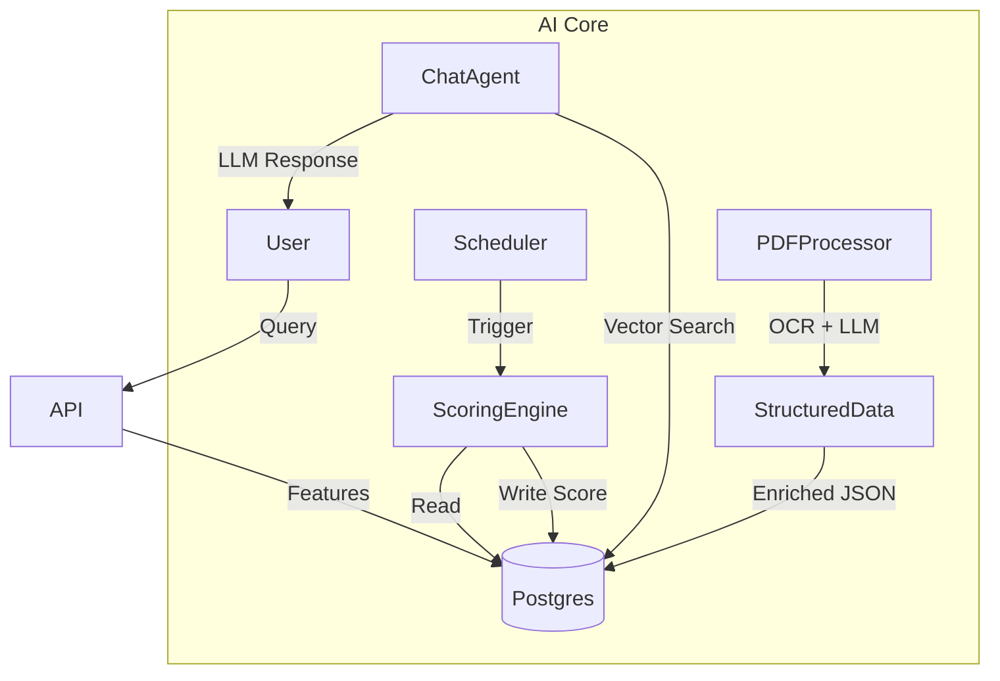

# AI Overview

**Version:** 1.0.0
**Date:** 2025-12-12

---

## 1. Vision
RealMap leverages Artificial Intelligence to transform raw real estate data into actionable intelligence. The AI ecosystem is designed as a **modular sidecar** service that does not block core platform operations.

---

## 2. Key AI Features

| Feature | Status | Description |
| :--- | :--- | :--- |
| **Project Scoring** | ✅ Active | Assigns a 0-100 "Project Quality Score" based on amenities, location, and developer track record. |
| **Chat Assistant** | 🚧 Beta | A natural language search interface ("Find 3BHKs near AIIMS") utilizing Vector Search. |
| **RERA PDF Parsing** | ✅ Active | Full OCR + LLM pipeline extracts structured data from 11 document types (Registration Certificate, Layout Plan, etc.). See [PDF Processing](../02-technical/orchestration/pdf-processing.md). |
| **Anomaly Detection** | ✅ Active | Flags listing price outliers (e.g., ₹50/sqft) to protect data integrity. |
| **Description Gen** | 🗓️ Planned | Auto-generates SEO-friendly marketing descriptions for projects. |
| **Price Forecasting** | 🗓️ Planned | Predicts future appreciation based on historical trends. |

---

## 3. High-Level Architecture

### The "Sidecar" Pattern
AI logic resides in a dedicated `ai/` microservice. It interacts with the main database but runs asynchronously (except for Chat). This ensures that heavy inference tasks (like PDF OCR) do not degrade the website's performance.

---

## 4. Governance & Principles
1.  **Transparency:** All AI-generated fields are tagged in the database (e.g., `source: ai_prediction`).
2.  **Human-in-the-Loop:** Critical flags (Compliance) require admin review before becoming public.
3.  **Fallback:** If the AI service is down, the platform gracefully degrades (hides scores/chat) without crashing.
4.  **Privacy:** No PII is sent to external LLMs. We prefer local models (Qwen, Llama) where possible.

---

## 5. Related Documents
- [AI Implementation Details](./AI_Implementation.md)
- [Technical Architecture](../02-technical/Architecture.md)
