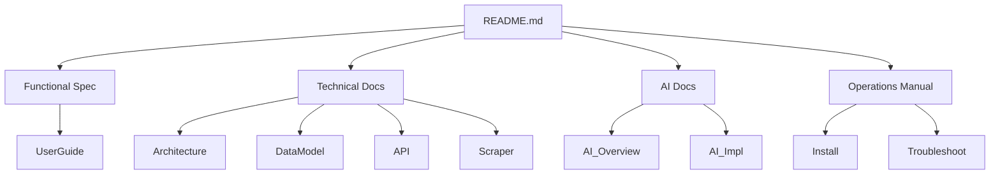

# Documentation Map

**Date:** 2025-12-12

## 1. New Structure (Retained)

| Category | File | Description |
| :--- | :--- | :--- |
| **Root** | `README.md` | Main Entry Point & Index. |
| **Functional** | `docs/01-functional/Functional_Specification.md` | Product Specs, UI/UX. |
|  | `docs/01-functional/User_Guide.md` | User Manual (Web + Mobile). |
| **Technical** | `docs/02-technical/Architecture.md` | System Design. |
|  | `docs/02-technical/Data_Model.md` | DB Schema & Provenance. |
|  | `docs/02-technical/API_Reference.md` | Endpoints & Schemas. |
|  | `docs/02-technical/Scraper_Pipeline.md` | ETL Logic. |
| **AI** | `docs/03-ai/AI_Overview.md` | AI Strategy & Features. |
|  | `docs/03-ai/AI_Implementation.md` | Agents, Prompts, Models. |
| **Operations** | `docs/04-operations/Operations_Manual.md` | Install, Deploy, Monitor. |

## 2. Deleted / Merged Documents

The following 40+ files have been consolidated into the above structure and removed:

*   **Merged into Functional Spec:** `functional_specification_document.md`, `UI-UX-Design.md`, `mobile_ux_session_summary.md`, `ui_refactor_spec.md`.
*   **Merged into User Guide:** `02-user-guide/*`, `rera-features.md`.
*   **Merged into Architecture:** `Architecture.md`, `system-architecture.md`, `architecture-summary.md`.
*   **Merged into Data Model:** `DATA_MODEL_*.md`, `DB_MODEL_*.md`, `DB_GUIDE.md`.
*   **Merged into API Reference:** `API-Reference.md`, `api-reference.md`.
*   **Merged into Scraper Pipeline:** `Scraper-Engine.md`, `Data-Pipeline.md`, `CONDITIONAL_SCRAPING.md`, `GEO_PIPELINE.md`.
*   **Merged into AI Docs:** `AI_Features.md`, `AI_Implementation_Guide.md`, `ai_runbook.md`, `AI_Architecture_and_Governance.md`.
*   **Merged into Ops Manual:** `01-getting-started/*`, `04-operations/*`, `DEV_GUIDE.md`.

## 3. Link Graph

